# HTTP 协议

主要内容来源于：《HTTP抓包实战》

链接：https://pan.baidu.com/s/15s2Pr7JEy0wJDZNNGbiEEA  提取码：9vwo 

## 什么是HTTP协议

协议是指计算机通信网路中两台计算机之间进行通信所必须共同遵守的规定或规则。

HTTP协议即超文本传送协议 (HTTP-Hypertext transfer protocol) 。

HTTP主要定义了客户端（浏览器）发送请求给服务器端的文本格式和服务器端发送响应给客户端的文本格式。

HTTP协议属于应用层协议。

HTTP协议不负责数据传输，只否则请求和响应。

## HTTP协议的工作原理

 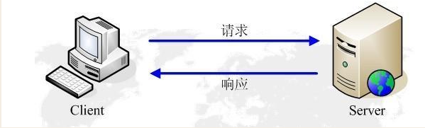

浏览器发送一个HTTP Request

服务器接受请求并处理 返回HTTP Response

浏览器解析HTTP Response并展示

## HTTP协议报文结构

HTTP 报文分2 个： 一个是HTTP 请求报文， 一个是HTTP 响应报文。

### HTTP请求报文的结构

HTTP请求报文由三部分组成：请求行（Request Line） ，HTTP header，HTTP  body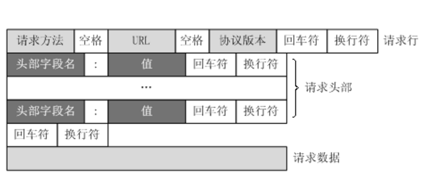

 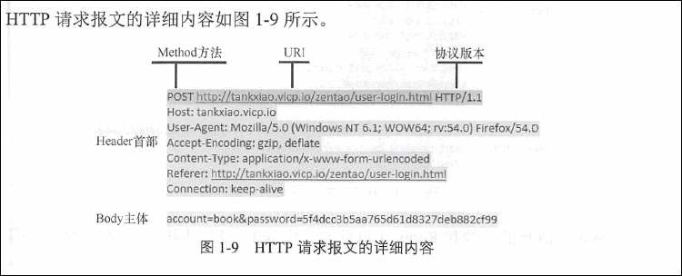

#### Request Line

请求行格式：请求方法 URI  协议版本

​          示例： GET http://localhost:8080/servlet_war/hello HTTP/1.1

请求方法: GET

请求URI:  http://localhost:8080/servlet_war/hello

协议版本: HTTP/1.1

#### HTTP Header

header格式： key : value

#### HTTP Body

**注意**：header 和body之间有一个空行，是必需的。

### HTTP响应报文的结构

HTTP响应报文由三部分组成：响应行（Response Line） ，Response header，Response body

 

#### Response Line

响应行格式：协议版本 状态码  状态码消息

示例：HTTP/1.1 200 OK

#### Response header

header格式： key : value

#### Response body

**注意**：header 和body之间有一个空行, 是必需的。

## URL

URL 的全称是Uniform Resource Locator  中文 统一资源定位符，用于完整的描述Internet上某一处资源的地址。

URI 的全称是Uniform Resource Identifier 中文  统一资源标识符， 用来唯一的标识一个资源。

URL是一种具体的URI。

### URL 格式

 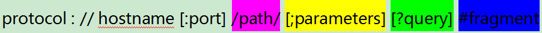

 图中中括号是可选项

- protocol： 协议，常用的协议是 HTTP，也可以是FTP等
- hostname： 主机地址，可以是域名，也可以是IP地址
- port： 端口  http协议默认端口是80端口,可以省略，如果使用了其他端口，则必须指明。
- path： 路径 网络资源在服务器中的指定路径
- parameter：  path parameter
- query：   Query String 发送给http服务器的数据
- fragment：  锚点 网页中可能会分为不同的片段，如果想访问网页后直接到达指定位置，可以在这部分设置

## HTTP 请求方法

HTTP1.0 定义了三种请求方法： GET, POST,HEAD

HTTP1.1 新增了五种请求方法：OPTIONS, PUT, DELETE, TRACE, CONNECT      

 

### GET请求

GET请求的数据会附在URL之后（就是把数据放置在HTTP请求行上），以?分割URL和传输数据，多个参数用&连接。

格式： ?key=value&key2=value2

GET 请求没有body。

HTTP协议规范没有对URL长度进行限制，但是在实际开发中存在的限制主要是特定浏览器和服务器对URL长度有限制，因此对于GET提交时，传输数据就会受到URL长度的限制。

### POST请求

POST 方法通常用来把表单中填好的数据发送给服务器。如图3 -4 所示。

 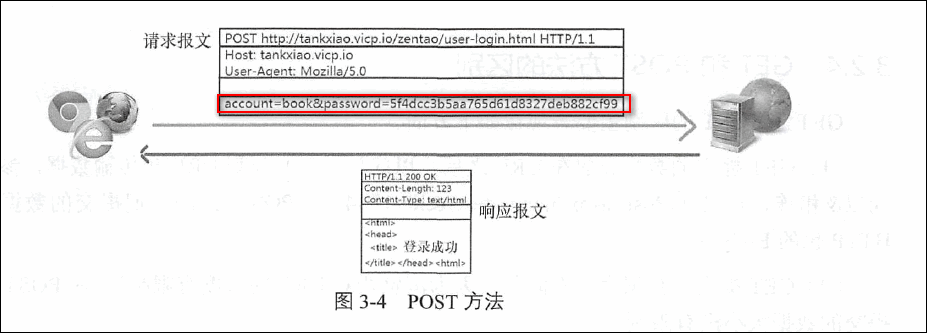

### GET 和POST 方法的区别

(1) GET 提交的数据会放在URL 之后， 以问号（?)分割URL 和传输数据， 参数之间以＆相连，如EditPosts . aspx?name=testl&id= 123456 。POST 方法是把提交的数据放在HTTP 包的Body 中。

(2) GET 提交的数据大小有限制（因为浏览器对URL 的长度有限制） ， 而POST 方法提交的数据大小没有限制。
(3) GET 方式需要使用Request. QueryString 来取得变量的值，而POST 方法通过Request.Form 来获取变量的值。
(4) GET 方式提交数据会带来安全问题，比如一个登录页面通过GET 方式提交数据时，用户名和密码将出现在URL 上， 如果页面可以被缓存或者其他人可以访问这台机器，就可以从历史记录获得该用户的账号和密码。

## HTTP状态码

### 什么是HTTP状态码

每个HTTP 响应报文都会携带一个状态码，用于告诉客户端请求是否成功。状态码是一个3 位数字的代码。

HTTP 状态码存在于HTTP 的响应报文中， 其作用是Web 服务器用来告诉客户端发生了什么事。

HTTP 响应报文中的第一行，由HTTP 协议版本号、状态码、状态消息3 部分组成。状态码用来告诉HTTP 客户端Web 服务器是否产生了预期的HTTP 响应。

### 状态码分类

HTTP / 1.1 中定义了5 类状态码，状态码由3 位数字组成， 第一个数字定义了响应的类别。

HTTP 状态码被分为5 大类， 支持如表3-2 所示的状态码。

 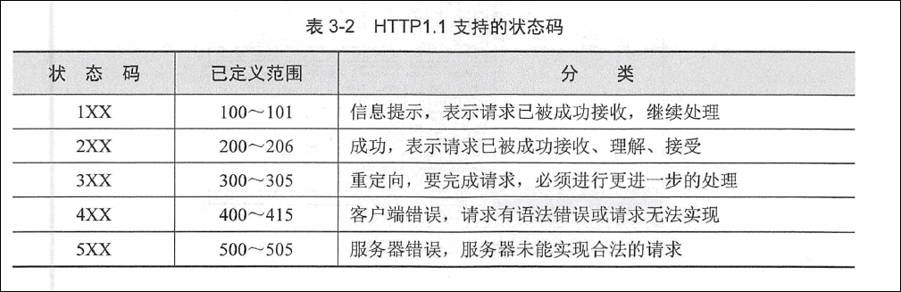

### 常见的状态码

 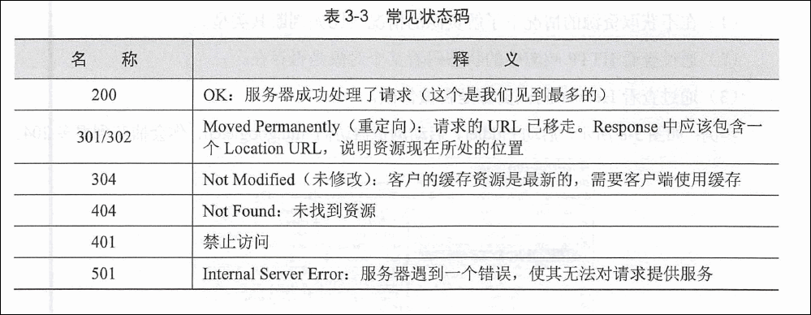

####  200 ( OK)

最常见的状态码就是成功响应状态码200 了， 它表明该请求被成功地完成，所请求的资源成功地发送回客户端。

#### 204 （No Content, 没有内容）

 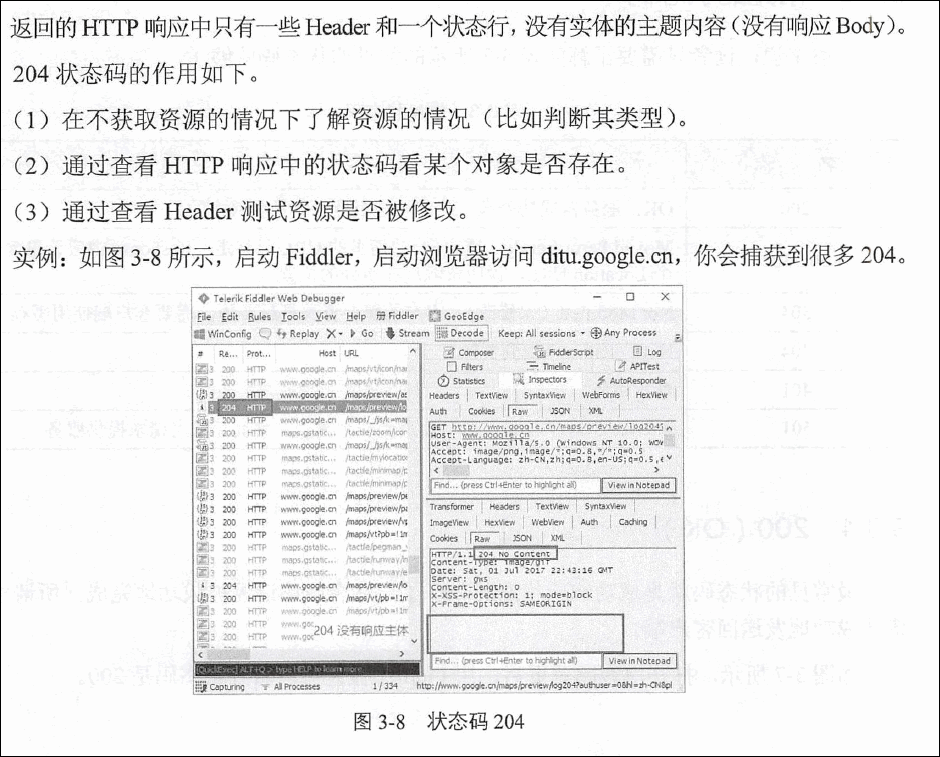

#### 206 ( Partial Content ，部分内容）

206 状态码代表服务器已经成功处理了部分GET 请求（只有发送GET 方法的HTTP请求， Web 服务器才可能返回206 ） 。

206 的应用场景如下。
（1） FlashGet、迅雷或者HTTP 下载工具都是使用206 状态码来实现**断点续传**的。
（2）将一个大文档分解为多个下载段同时下载，比如在线看视频。

 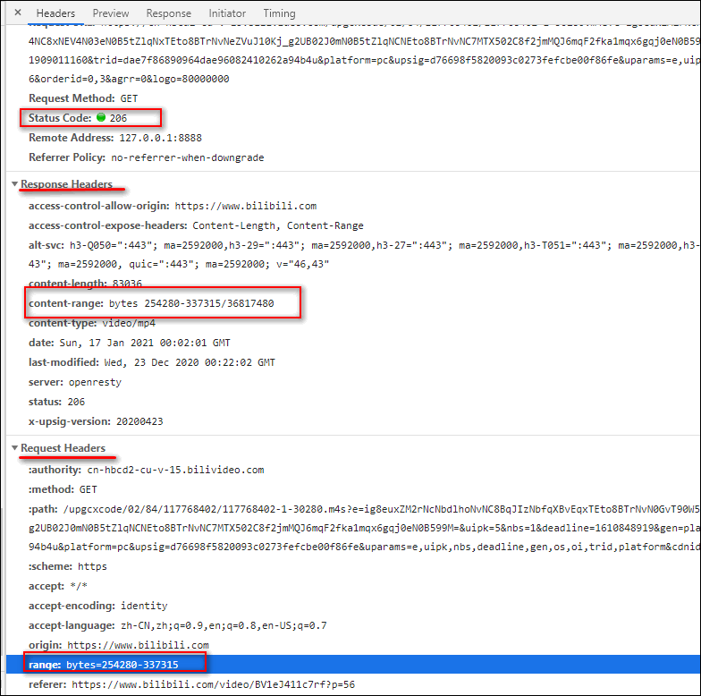

浏览器发送一个GET 方法的HTTP 请求， Header 中包含range: bytes=254280-337315 （意思就是请求得到254280-337315 之间的数据）。

Web 服务器返回一个2 06 的HπP 响应。Header 中包含content-range: bytes 254280-337315/36817480（表明这次返回的内容范围）。

#### 301 ( Moved Permanently)

服务器返回301的时候，表示请求的网页己经永久性地转移到另一个地址。

在如下情况下需要用到301 。

- 防止用户输错域名。比如Google 担心用户输错域名，就把其他类似的域名买下来，比如goOgle .com ，然后重定向到www. google.com 。

- 网站更换域名。一些网站壮大后， 会换个更好的域名。比如京东以前的域名是www.360buy.com ，现在的域名是www.jd.com 。

- 有多个权重不错的域名，需要把所有的权重都传递到新域名上，这就需要301 重定向了。如果不设置301 ， 多个域名绑定在一个主机头上，会被搜索引擎认为是两个相同的站点，不利于网站的排名。绑定的域名越多，内容重复度也就越高，排名越低。

  

 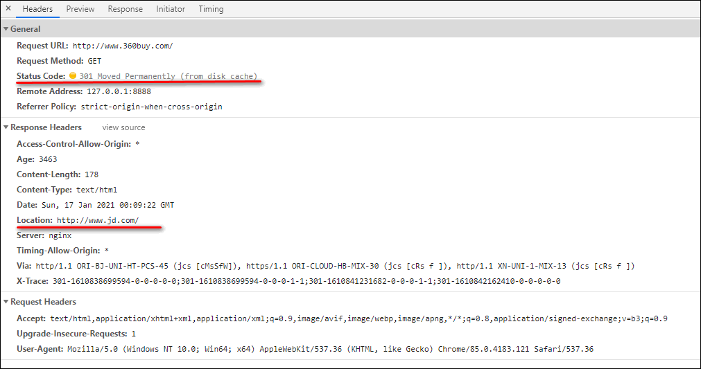

(1 ）浏览器发送请求访问www.360buy.com ，服务器返回301 ，并且Location 是www.jd.com 。
(2 ）浏览器会读取Location 中的URL ， 自动发送一个新的Hπ？ 请求去访问www.jd. com 。

#### 302 ( Found )

当我们访问一个URL 的时候，服务器要我们访问另一个资源，这时候浏览器会继续发一个HTTP ， 请求访问新的资源。

实例：如图3-11 所示，在未登录状态下，直接访问需要登录才能访问的页面，会被服务器返回302 ，跳转到登录页面。具体操作步骤如下。

 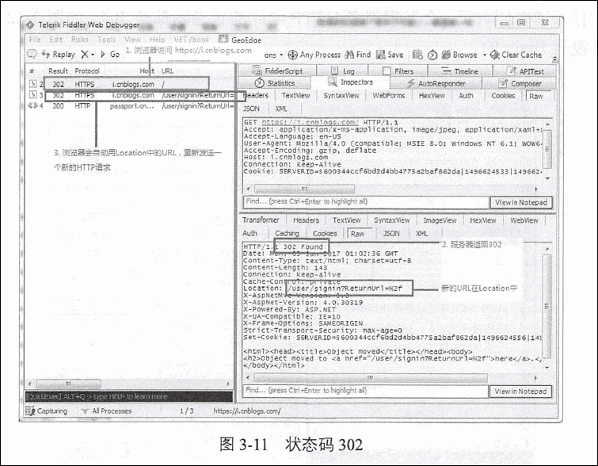

(1 ）启动Fiddler ，打开浏览器，直接在地址栏中输入https: //i.cnblogs . com/ 。
( 2 ）在Fiddler 中可以看到服务器返回302 ， 井且Location= /user/signin?ReturnUrl=% 2f（告诉客户端，新的资源在这里） 。
(3 ）浏览器会自动再发送一个新的HTTP 请求一一去访问https ://i.cnblogs .com/ user/signin?ReturnUrl=%2f。

#### 301 和302 的区别

状态码301 和302 在语法上是一模一样的，都是在Location 中返回新的URL 。两者的区别在于：

- 301 表示旧地址的资源己经被永久地移除了（这个资源不可访问了），搜索引擎会把权重算到新地址；
- 302 表示旧地址的资源还在（ 仍然可以访问〉，这个重定向只是临时地从旧地址跳转到新地址，搜索引擎会把权重算到旧地址。

#### 304 ( Not Modified )

304 状态码代表上次的文档己经被缓存了，还可以继续使用。

 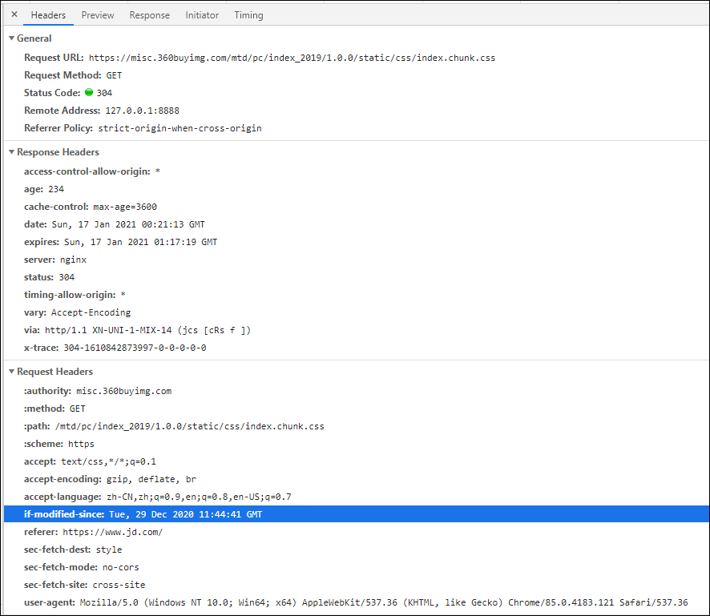

#### 400 ( Bad Request )

状态码400 表示客户端请求有语法错误，发送的HTTP 请求中的数据有错误（如表单有错误、Cookie 有错误）。不能被服务器所理解。

#### 401 ( Unauthorized )

状态码401 是指未授权错误。有些网页采用的是HTTP 基本认证CBasic Authentication),需要在HTTP 请求中带上Authorization Header，否则服务器会返回状态码401。

#### 403 ( Forbidden )

403 状态码表示Web 客户端发送的请求被Web 服务器拒绝了。如果服务器想说明为什么拒绝请求，可以在Body 中描述原因。但这个状态码通常表示服务器不想说明拒绝原因。

#### 404 ( Not Found )

当你访问一个URL ，这个URL 的域名是正确的，但是资源不存在，服务器就会返回404 状态码，告诉浏览器资源不存在（意味着输错了URL ） 。

#### 500 ( Internal Server Error )

状态码500 代表服务器内部错误。出现错误的原因有很多，比如代码的错误、数据库连接语句出错、程序内部抛出异常、空指针错误等。

#### 503 ( Server Unavailable)

状态码503 表示服务器暂时不可用。由于服务器维护或者过载，服务器当前无法处理请求； 这个状况是临时的， 并且将在一段时间以后恢复。

## HTTP 协议Header

Header 的语法格式是“key: value“ ，一行一个Header。每一个Header 都有特殊的作用。

### Cache 相关的Header

HTTP 缓存是指当Web 请求抵达缓存时，如果本地有“己缓存的”副本，就可以从本地存储设备而不是从原始服务器中提取这个文档。

### Cookies

Cookie 是一种HTTP Header ， 是HTTP 中非常重要的内容。它由key=value 的形式组成。

浏览器把Cookie 通过HTTP 请求中的“ Cookie : header ，，发送给Web 服务器； 

Web 服务器通过HTTP 响应中的“ Set-Cookie: header“ 把Cookie 发送给浏览器；

### Accept

Accept 表示浏览器客户端可以接受的媒体类型。

通配符＊代表任意类型。

### Accept-Encoding

Accept-Encoding 跟压缩有关，浏览器发送HTTP 请求给Web 服务器， HTTP 请求中的Header 有Accept-Encoding: gzip, deflate （告诉服务器，浏览器支持gzip 压缩〉。

### Accept-Language

Accept-Language 的作用是浏览器声明自己接受的语言。

语言跟字符集的区别在于： 中文是语言，中文有多种字符集，比如b1挝、gb2313 、gbk等。

### User-Agent

User-Agent 的作用是浏览器用来告诉服务器， 客户端使用的操作系统及版本、CPU 类型、浏览器及版本、浏览器渲染引擎、浏览器语言、浏览器插件等。

如果我们想模拟各种不同的客户端，只需要修改User-Agent ，就可以伪装成各种客户端。

### Referer

HTTP 协议头中的referer 主要用来让服务器判断来源页面，即用户是从哪个页面来的。网站通常用其来统计用户来源，看用户是从搜索页面来的，还是从其他网站链接过来的，或是从书签等访问的，以便合理定位网站。

Referer 有时也被用作防盗链，即下载时判断来源地址是不是在网站域名之内，否则就不能下载或显示。

### Connection

从HTTP/1.1 起，系统默认都开启了Connection :Keep -Alive ，保持连接特性。

HTTP 协议是基于TCP 协议的。当一个网页完全打开后， 客户端和服务器之间用于传输HTTP 数据的TCP 连接不会关闭；如果客户端再次访问这个服务器上的网页， 将会继续使用这一条己经建立的连接。

Keep-Alive 不会永久保持连接，它有一个保持时间，可以在不同的服务器软件（如Apache ）中设定这个时间。

### Host

Host 这个Header 是必需的，它的作用是指定被请求的主机和端口号，它通常从HTTP URL中提取出来。

## HTTP 协议中的缓存

HTTP 中具有缓存功能的是浏览器缓存和代理服务器缓存。
HTTP 缓存是指当Web 请求抵达缓存时，如果本地有“己缓存的”副本， 就可以从本地存储设备而不是从原始服务器中提取这个文档。

### 缓存的优点

- 减少了冗余的数据传输，节省了传输时间和带宽。
- 减少了服务器的负担，大大提高了网站的性能。
- 加快了客户端加载网页的速度。

### 如何判断缓存新鲜度

Web 服务器通过以下2 种方式来判断浏览器缓存是否最新。

- 浏览器把缓存文件的最后修改时间通过Header  “ If-Modified-Since ＂告诉Web服务器。
- 浏览器把缓存文件的ETag 通过Header “ If-None-Match ＂告诉Web 服务器。

### 通过最后修改时间来判断缓存新鲜度

浏览器可以通过缓存文件的修改时间来判断缓存的新鲜度。具体步骤如下。

1. 如果浏览器客户端想请求一个文档，它首先检查本地缓存，发现存在这个文档的缓存，获取缓存中文档的最后修改时间，通过“ If-Modified -Since ＂发送HTTP 请求给Web 服务器。
2. Web 服务器收到HTTP 请求，将服务器的文档修改时间（ Last-Modified ）跟HTTP请求Header 中的If-Modified-Since 相比较。如果时间是一样的，说明缓存还是最新的，Web 服务器将发送状态码304 ( Not Modified ） 给浏览器客户端，告诉客户端直接使用缓存里的版本。
3. 假如该文档己经被更新了， Web 服务器将发送该文档的最新版本给浏览器客户端。

### 与缓存有关的Header

 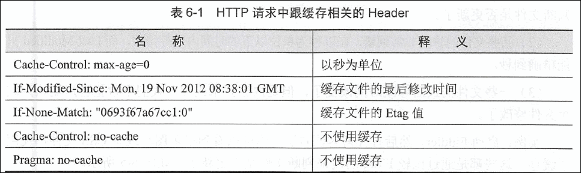

 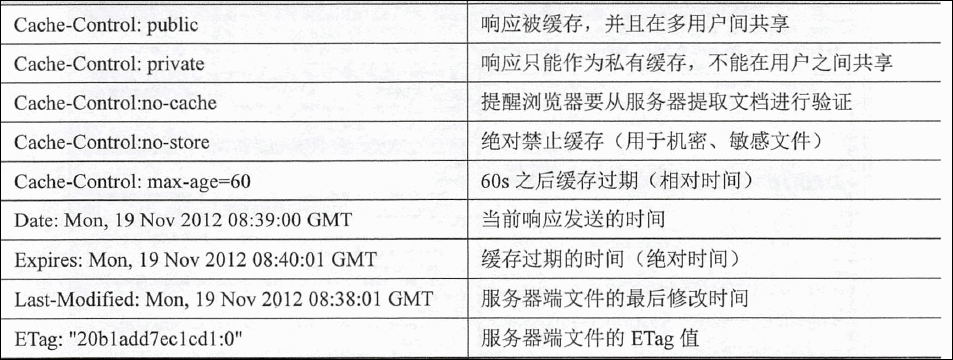

如果同时存在cache-control 和Expires 怎么办呢？浏览器总是优先使用cache-control  ,如果没有cache-control 才考虑Expires。

### ETag

ETag 是Entity Tag （实体标签）的缩写，是根据实体内容生成的一段hash 字符串（类似于MD5 或者SHAl 之后的结果），可以标识资源的状态。当资源发生改变时， ETag 也随之发生变化。

ETag 是Web 服务端产生的，然后发给浏览器客户端。浏览器客户端不用关心ETag 是如何产生的。

使用E Tag 主要是为了解决一些Last - Modified 无法解决的问题。

- 某些服务器不能精确得到文件的最后修改时间，这样就无法通过最后修改时间来判断文件是否更新了。
- 某些文件的修改非常频繁，在以秒为单位以下的时间内进行修改，而Last-Modified 只能精确到秒。
- 一些文件的最后修改时间改变了，但是内容并未改变，我们不希望客户端认为这个文件修改了。

### 浏览器不使用缓存

使用【Ctrl+F5 】快捷键强制刷新浏览器，可以让浏览器不使用缓存。

(1）浏览器发送HTTP 请求给Web 服务器， Header 中带有Cache-Control: no-cache,明确告诉Web 服务器客户端不使用缓存。
(2)  Web 服务器将把最新的文档发送给浏览器客户端。

### 直接使用缓存，不去服务器验证

按【F 5 】快捷键刷新浏览器和 在地址栏里输入网址，然后按回车键，这两个行为是不一样的。

按【F 5 】快捷键刷新浏览器，浏览器会去Web 服务器验证缓存。

如果是在地址栏输入网址然后按回车键，浏览器会“直接使用有效的缓存”，而不会发送HTTP 请求去服务器验证缓存，这种情况叫作缓存命中。

### 如何设置IE 不使用缓存

打开IE ，单击工具栏上的工具－＞ Internet 选项－＞常规·＞ 浏览历史记录·＞设置，“从不”，然后保存，可以让浏览器不使用缓存。

 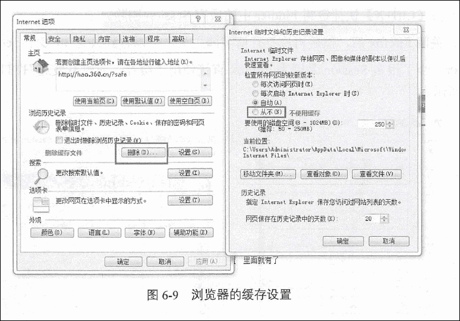

### 公布缓存和私有缓存的区别

“ Cache-Control: public ”指可以公有缓存，缓存可以由数千名用户共享。

“ Cache-Control :private ＂ 指只支持私有缓存， 私有缓存是单个用户专用的。

## HTTP 协议压缩

HTTP 压缩是指Web 服务器和浏览器之间压缩传输“ 文本内容” 的方法。HTTP 采用通用的压缩算法，比如用gzip 来压缩HTt\在L 、JavaScript 、css 文件，能大大减少网络传输的数据量，提高了用户显示网页的速度。当然，这同时也会增加一点点服务器的开销。

### HTTP 压缩的过程

1. 浏览器发送HTTP 请求给Web 服务器，请求中的Header 能Accept-Encoding: gzip,deflate（告诉服务器，浏览器支持gzip 压缩〉。
2.  Web 服务器接到HTTP请求后，生成原始的HTTP响应，其中有原始的Content-Type和Content-Length 。
3. Web 服务器**通过gzip 来对HTTP 响应进行编码**(一般不会对请求压缩)，编码后Header 中有Content-Type和Content-Length （压缩后的大小），并且增加了Content-Encoding:gzip ，然后把HTTP响应发送给浏览器。
4. 浏览器接到HTTP 响应后，根据Content-Encoding:gzip 来对HTTP 响应进行解码，获取到原始HTTP 响应后显示出网页。

#### 内容编码类型

HTTP 定义了一些标准的内容编码类型，并允许用扩展的形式添加更多的编码。

Content-Encoding header 就是用这些标准化的代号来说明编码时使用的算法。

gzip 表明实体采用GNU zip 编码。
compress 表明实体采用UNIX 的文件压缩程序。
deflate 表明实体是用zlib 的格式压缩的。
identity 表明没有对实体进行编码；当没有Content”Encoding header 时，就默认为这种情况。

gzip 、compress 以及deflate 编码都是无损压缩算法，用于减少传输报文的大小，不会导致信息损失。其中gzip 通常效率最高，使用最为广泛。

#### 压缩的好处

HTTP 压缩可以将纯文本压缩至原内容大小的40% ，从而节省了60% 的数据传输。

#### gzip 的不足之处

JPEG 这类文件用gzip 压缩的效果不够好， gzip 占用了一些服务器和客户端的CPU 。

#### gzip 是如何压缩的

简单来说，在ip 压缩是在一个文本文件中找出类似的字符串，并临时替换它们，从而使整个文件变小。这种形式的压缩对W出来说非常适合，因为HTML 和css 文件通常包含大量重复的字符串，例如空格、标签。

#### HTTP 请求也是可以编码的

浏览器一般不会对HTTP 请求编码，但是一些程序在发送HTTP 请求时会对其进行编码。

### URL Encode 介绍 (TODO)

URL 只能用英文字母、数字或者某些标点符号，不能使用其他文字和符号。

URL Encode ( URL 编码〉就是把所有非英文字母、数字字符都替换成百分号（%〉后加两位十六进制数，比如空格的编码为 %20

#### 查询字符串中包含汉字

#### POST 中的数据包含汉字

POST 中的主体在传输的时候同样会被转义

## 深入理解Cookie 机制

### HTTP 协议是无状态的

对于浏览器的每－次请求， 服务器都会独立处理， 不与之前或之后的请求发生关联。

即使是同一个浏览器发送了3 个请求，服务器也会独立处理这3 个请求，服务器并不知道这3 个请求是来自同一个浏览器。

服务器需要识别浏览器请求， 就必须弄清楚浏览器的请求状态。既然HTTP 协议是无状态的，那就让服务器和浏览器共同维护一个状态，这就是会话机制。

### 会话机制

 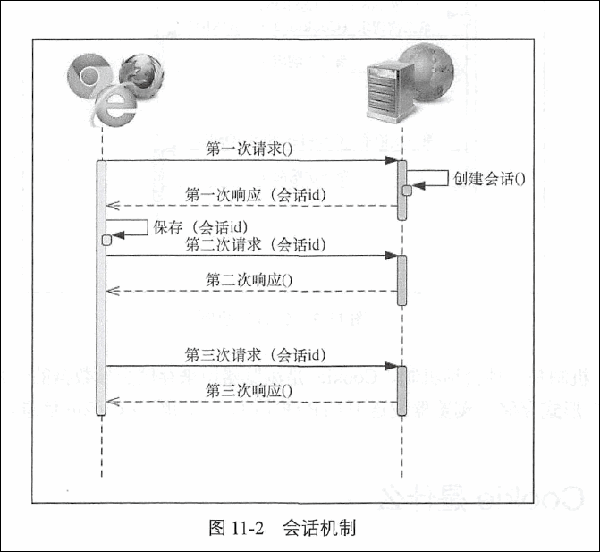

1. 浏览器第一次请求服务器时，服务器创建一个会话， 并将会话的id 作为响应的一部分发送给浏览器。
2. 浏览器存储会话id ， 并在后续第二次和第三次请求中带上会话id 。服务器取得请求中的会话id 就知道是不是同一个用户了。这样一来，后续请求与第一次请求就产生了关联。

### Cookie 机制

服务器在内存中保存会话对象。浏览器可以使用C ookie 机制保存会话id。

 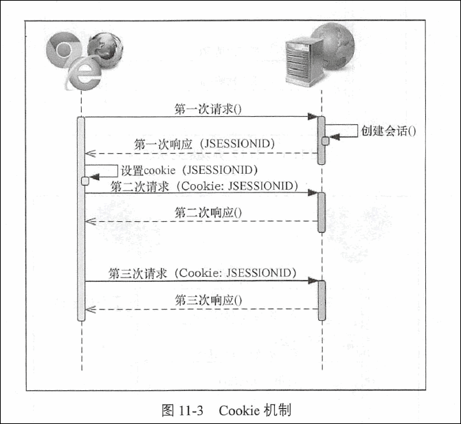

Cookie 机制是一种会话机制。Cookie 是浏览器用来存储少量数据的一种机制，数据以“ key=value ”形式存储，浏览器发送HTTP 请求时， 自动附带cookie 信息。

### Cookie 是什么

Cookie 是一小段文本信息，伴随着用户请求和页面在浏览器和Web 服务器之间传递。
Cookie 是一种HTTP Header ，以“ key=value ”的形式组成，两个Cookie 之间用分号隔开。

浏览器把Cookie 通过HTTP 请求中的Header，比如Cookie: ip_country=CN发送给Web 服务器。

Web 服务器通过HTTP 响应中的Header ，比如Set-Cookie: ip_country=CN 把Cookie 发送给浏览器。

### Cookie 的作用

Cookie 最主要的作用是用来做用户认证，还可以用于保存用户的一些其他信息。

Cookie 也可以用于互联网精准广告定向技术，比如用户浏览了某些商品，就可以用Cookie 将其记录下来，对网民所有的上网行为进行个性化的深度分析：按广告主需求锁定目标受众，进行一对一传播，提供多通道投放，按照效果付费。

### Cookie 的属性

Set- Cookie: cook工e user token=C5CBD6FBDODAOEE4B5DC36E7075D8CDA; Expires=Thu , 06一Jul-201709:17 : 46 GMT; Path=/ ; HttpOnly

**Expires** 属性： Expires 的值是一个时间，代表过期时间。过了这个时间， 该Cookie就失效了。如果不指定Expire time ， 表示关闭浏览器／页面的时候， 此Cookie 就应该被浏览器删除了。

**Path** 属性：表示Cookie 所属的路径，asp .net 默认为“／”，就是根目录。在同一个服务器上的目录如下： ／test／ 、／test/cd/、／test/dd/ 。现假设一个Cookie1的path 为／test/ , Cookie2的path 为／test/cd/，那么test 下的所有页面都可以访问到Cookiel1，而／test/dd/的子页面不能访问cookie2 。这是因为Cookie 只能让其path 路径下的页面访问。

**HttpOnly** 属性: 这是个关于安全方面的属性，将一个Cookie 设置为HttpOnly 后，通过Javascript 脚本将无法读取到Cookie 信息，这能有效地防止黑客用xss 发起攻击。一般来说，跟登录相关的Cookie 必须设置为HttpOnly 。

### Cookie 的分类

我们可以大致把Cookie 分为2 类： 会话Cookie 和持久Cookie 。

会话Cookie 是一种临时的cookie ，它记录了用户访问站点时的设置和偏好；关闭浏览器，会话Cookie 就被删除了。

持久Cookie 存储在硬盘上， 不管浏览器退出或者计算机重启，持久cookie 都继续存在。持久Cookie 有过期时间。

### Cookie 保存在哪里

Cookie 是存在硬盘上的， IE 存Cookie 的地方和Firefox 存Cookie 的地方不一样。不同的操作系统存Cookie 的地方也可能不一样。

不同的浏览器会在各自的独立空间存放Cookie ， 互不干涉。

### 使用和禁用Cookie

可以在I浏览器中设置禁用Cookie。

## Cookie 劫持攻击（TODO）

## HTTP 基本认证

HTTP 协议是无状态的，浏览器和Web 服务器之间可以通过Cookie 来识别身份。一些桌面应用程序（比如新浪桌面客户端、OneDrive 客户端和Dropbox 客户端）跟Web 服务器之间是如何识别身份呢？

HTTP 协议中还有两种认证方式，分别是**基本认证**和**摘要认证**。认证就是客户端要给服务器出示一些自己的身份证明，来证明自己是谁， 一旦服务器知道了客户端的身份，就可以判定客户端可以进行访问了。通常是通过提供用户名和密码来进行认证的。

### 什么是HTTP 基本认证

一些网站和Web 服务使用的是HTTP 基本认证。有些桌面应用程序也通过HTTP 协议跟Web 服务器交互，桌面应用程序一般不会使用Cookie ，而是把“用户名＋冒号+密码” 用Base64 编码放在HTTP 请求中的Header Authorization 中发送给服务端，这种方式叫HTTP基本认证（ Basic Authentication ） 。

在基本认证中， Web 服务器可以拒绝一个事物，要求客户端提供有效的用户名和密码。服务器会返回401 状态码来初始化认证质询，并用WWW-Authenticate 响应首部指定要访问的安全域。浏览器收到质询肘，**会打开一个对话框，请求用户输入用户名和密码**，然后将用户名和密码用Base64 编码，再用Authorization 请求首部发送给服务器。