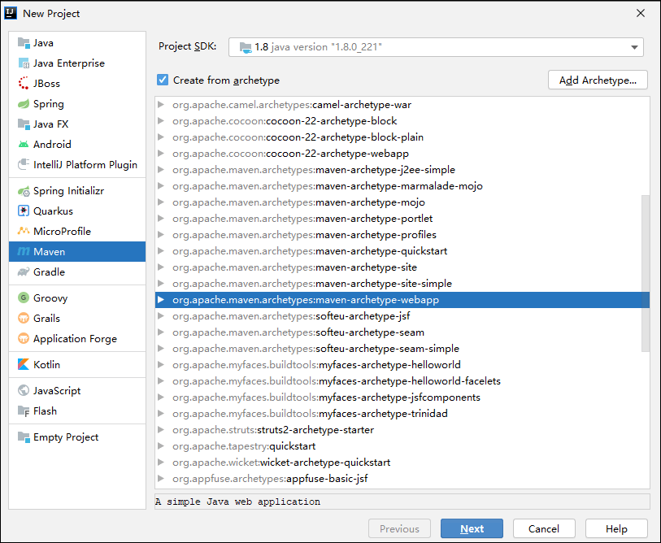

# Java Web

Java Web三大组件：Servlet程序，Filter过滤器，Listener监听器。


## Servlet

Servlet是JavaEE规范之一。

Servlet 3.1 规范地址：https://jcp.org/en/jsr/detail?id=340

下载地址：https://download.oracle.com/otndocs/jcp/servlet-3_1-fr-eval-spec/index.html

Servlet4.0  规范地址：https://jcp.org/en/jsr/detail?id=369

下载地址：https://download.oracle.com/otndocs/jcp/servlet-4-final-eval-spec/index.html


Servlet 用来处理请求返回响应。


规范就是接口

```xml
<dependency>
  <groupId>javax.servlet</groupId>
  <artifactId>javax.servlet-api</artifactId>
  <version>4.0.1</version>
  <scope>provided</scope>
</dependency>
```


## Filter


## Listener


## Session


## Cookie


## Application


## Web应用程序的目录结构

project_name/pom.xml

project_name/src/main/java

project_name/src/main/resources

project_name/src/test/java

project_name/src/test/resources


project_name/src/main/webapp/WEB-INF/web.xml

project_name/src/main/webapp/index.jsp

roject_name/src/main/webapp/WEB-INF/lib 


## IDEA 创建Maven管理的web项目

 

## IDEA 配置Tomcat


File | Settings | Build, Execution, Deployment | Application Servers

 


 


```xml

```


## Tomcat 版本和Servlet的版本关系

servlet 3.0 以后 就使用注解版本的servlet。


## Tomcat三大部署项目方式

https://blog.csdn.net/sinat_32366329/article/details/80261706


默认访问的是ROOT 和 index.html


创建一个web 模块

 


### hello servlet

实现接口 javax.servlet.Servlet

web.xml中配置servlet 

```xml
<servlet>
    <servlet-name>Hello Servlet</servlet-name>
    <servlet-class>cn.java.money.servlet.HelloWorld</servlet-class>
</servlet>
<servlet-mapping>
    <servlet-name>Hello Servlet</servlet-name>
    <url-pattern>/hello</url-pattern>
</servlet-mapping>
```

http://localhost:8080/hello 


## servlet生命周期

执行构造器方法   第一次访问的时候执行

执行init 初始化方法  第一次访问的时候执行

执行service方法   每次请求都执行

执行destroy方法   


 


 


## ServletConfig,java 

 


init 方法要调用父类init, 否则servletconfig 是空的

## ServeltContext 

ServeltContext  是一个接口，表示servlet的上下文

一个web工程，只有一个ServletContext对象实例

ServletContex对象是一个域对象

域对象：可以像Map一样存取数据的对象，这里的域指的是存取数据的操作范围。

ServletContex对象是在web工程部署的时候创建的。

### ServletContext类的四个作用

获取web.xml中配置的上下文参数context-param

```xml
<context-param>
    <param-name>aa</param-name>
    <param-value>AA</param-value>
</context-param>
```

```java
System.out.println(getServletContext().getInitParameter("aa"));
```

获取当前的工程路径

获取工程部署以后再服务器硬盘上的绝对路径

```java
System.out.println(getServletContext().getContextPath()); //   /servlet_war
System.out.println(getServletContext().getRealPath("/")); //   D:\imooc\evn\apache-tomcat-8.5.58\webapps\servlet_war\
```

像Map一样存取数据

```
 getServletContext().setAttribute("","");
 getServletContext().getAttribute("");
```


## Cookie

**Cookie**是由服务器端生成，发送给User-Agent（一般是浏览器），浏览器会将Cookie的key/value保存到某个目录下的文本文件内，下次请求同一网站时就发送该Cookie给服务器（前提是浏览器设置为启用cookie）。Cookie名称和值可以由服务器端开发自己定义，对于JSP而言也可以直接写入JSESSIONID用于标记一个会话(session)，这样服务器可以知道该用户是否合法用户以及是否需要重新登录等，服务器可以设置或读取Cookies中包含信息，借此维护用户跟服务器会话中的状态。


**Cookie**由服务器写给浏览器的。由浏览器来保存。客户端保存的Cookie信息，可以再次带给服务器。


**Cookie是客户端技术**。


javax.servlet.http.Cookie


服务端添加cookie响应给客户端，cookie在此处产生

```java
Cookie cookie = new Cookie("name", "wangcf"); 

response.addCookie(cookie);
```

在客户端获取到cookie以后，再次访问服务器，浏览器会自动在请求中添加cookie。


服务端获取客户端请求中的cookie

```java
Cookie[] cookies = request.getCookies(); 
if (cookies != null) {    
    for (Cookie coo: cookies) {        
        String name = coo.getName();        
        String value = coo.getValue();        
        System.out.println("name=" + name + ";value=" + value);    
    } 
}
```


设置cookie的有效期

-1（默认值），或其它负数，关闭浏览器后失效；

0   response返回到浏览器后即被删除，下次request将不会传输该cookie；

其它正数，存在多少秒 ,超过该秒后的request将无该cookie

```java
//cookie的设置必须在addCookie之前才有效
cookie.setMaxAge(60 * 60 * 24);
response.addCookie(cookie);
```

清除浏览记录其实就是清除Cookie， 删除cookie是没有相应的类似delete方法的可以设置maxAge 为0 。

```java
Cookie cookie = new Cookie("history","");
cookie.setMaxAge(0); //设置立即删除
cookie.setPath("/CookieDemo02");
response.addCookie(cookie);
```


设置cookie在浏览器的存放地址；该地址下有cookie，则request将带上该cookie

```java
//只有访问pattern域名的request才回带cookie
cookie.setDomain(pattern);
//是有访问以上域名的uri的路径才会带cookie
cookie.setPath(uri);
```


如何区分Cookie：通过名称不行,应通过domain+path+name来区分的。

