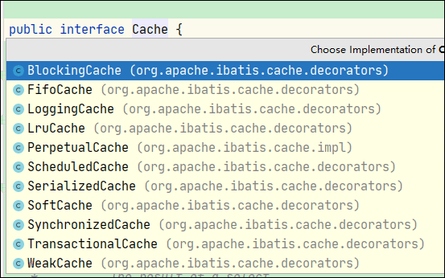

# JDBC

##  JDBC 规范


##  JDBC 基本操作


## JDBC 元数据

### 元数据类型

* 数据库元数据   

  java.sql.DatabaseMetaData

* SQL 语句参数元数据

  java.sql.ParameterMetaData

* 结果集元数据 

  java.sql.ResultSetMetaData

### 如何获取元数据对象

```java
//数据库元数据获取方式
DatabaseMetaData databaseMetaData = conn.getMetaData();
//sql语句参数元数据
ParameterMetaData parameterMetaData = ps.getParameterMetaData();
//结果集元数据
ResultSetMetaData resultSetMetaData = ps.getMetaData();
ResultSetMetaData resultSetMetaData = rs.getMetaData();
```

## DataSource

javax.sql.DataSource接口负责建立与数据库的连接，当在应用程序中访问数据库时不必编写连接数据库的代码，直接引用DataSource获取数据库的连接对象Connection即可。


数据库连接池负责分配、管理和释放数据库连接，它允许应用程序重复使用一个现有的数据库连接，而不是再重新建立一个；


#  MyBatis

## MyBatis 简介 

DBUtils QueryRunner  和 Spring  JdbcTemplate 是对JDBC封装的**工具类**。

工具类： sql语句编写在java代码中，硬编码高耦合。

DBUtils 坐标

```xml
<dependency>
    <groupId>commons-dbutils</groupId>
    <artifactId>commons-dbutils</artifactId>
    <version>1.7</version>
</dependency>
```

 Spring  JdbcTemplate 坐标

```xml
<dependency>
    <groupId>org.springframework</groupId>
    <artifactId>spring-jdbc</artifactId>
    <version>5.1.5.RELEASE</version>
</dependency>
```


MyBatis 和 Hibernate 是对JDBC封装的**框架**。

Hibernate: 全自动全映射（Object Relation Mapping）框架：旨在消除sql，HQL.

MyBatis: 半自动，sql与java编码分离，sql由开发人员编写。


## Mybatis Hello word


Mybatis  坐标

```xml
<dependency>
    <groupId>org.mybatis</groupId>
    <artifactId>mybatis</artifactId>
    <version>3.5.6</version>
</dependency>
```

MySql  Driver 坐标

```xml
<dependency>
    <groupId>mysql</groupId>
    <artifactId>mysql-connector-java</artifactId>
    <version>8.0.22</version>
</dependency>
```

Junit 5 坐标

```xml
<dependency>
    <groupId>org.junit.jupiter</groupId>
    <artifactId>junit-jupiter</artifactId>
    <version>RELEASE</version>
</dependency>
```


数据库 和 表 的创建

```sql
-- 创建数据库
create database mybatis;

use mybatis;

-- 创建表
create table tbl_employee(
	id int(11) primary key auto_increment,
    last_name varchar(255),
    gender char(1),
    email varchar(225)
); 

-- 初始化数据
insert into tbl_employee (last_name,email,gender, dep_id) values 
('jack','jack@qq.com','男',1),
('rockall','rockall@qq.com','男',1),
('grace','grace@qq.com','男',1);
```

tbl_employee 表对应的Java对象

git@github.com:zheting/MyBatis-learning.git

```java
package cn.java.money.demo1;

public class Employee {

    private Integer id;
    private String lastName;
    private String email;
    private String gender;
	
    //省略getter/setter

    @Override
    public String toString() {
        final StringBuilder sb = new StringBuilder("Employee{");
        sb.append("id=").append(id);
        sb.append(", lastName='").append(lastName).append('\'');
        sb.append(", email='").append(email).append('\'');
        sb.append(", gender='").append(gender).append('\'');
        sb.append('}');
        return sb.toString();
    }
}

```


MyBatis全局配置文件 

在resouce目录下创建mybatis-config.xml

```xml
<?xml version="1.0" encoding="UTF-8" ?>
<!DOCTYPE configuration
        PUBLIC "-//mybatis.org//DTD Config 3.0//EN"
        "http://mybatis.org/dtd/mybatis-3-config.dtd">
<configuration>
    <environments default="development">
        <environment id="development">
            <transactionManager type="JDBC"/>
            <dataSource type="POOLED">
                <property name="driver" value="com.mysql.cj.jdbc.Driver"/>
                <property name="url" value="jdbc:mysql://localhost:3306/mybatis?serverTimezone=GMT"/>
                <property name="username" value="root"/>
                <property name="password" value="123456"/>
            </dataSource>
        </environment>
    </environments>

</configuration>
```

Mapper 文件

```xml
<?xml version="1.0" encoding="UTF-8" ?>
<!DOCTYPE mapper
        PUBLIC "-//mybatis.org//DTD Mapper 3.0//EN"
        "http://mybatis.org/dtd/mybatis-3-mapper.dtd">

<mapper namespace="com.xxx.zzz.yyy">

    <select id="selectEmp" resultType="cn.java.money.demo1.Employee">
        select * from tbl_employee where id = #{id}
    </select>

</mapper>
```

说明：namespace: 命名空间是**唯一**识别的一套名字，这样当对象来自不同的地方但是名字相同的时候就不会含糊不清了。

​			resultType:  把相同的列名和字段名映射

配置Mapper文件到主配置文件

```xml
<mappers>
    <mapper resource="EmployeeMapper1.xml"/>
</mappers>
```

测试


```java
package cn.java.money.demo1;

import org.apache.ibatis.io.Resources;
import org.apache.ibatis.session.SqlSession;
import org.apache.ibatis.session.SqlSessionFactory;
import org.apache.ibatis.session.SqlSessionFactoryBuilder;
import org.junit.jupiter.api.Test;

import java.io.IOException;
import java.io.InputStream;

public class MyBatisTest {

    @Test
    public void test1() throws IOException {
        String resource = "mybatis-config.xml";
        InputStream inputStream = Resources.getResourceAsStream(resource);
        SqlSessionFactory sqlSessionFactory = new SqlSessionFactoryBuilder().build(inputStream);
        SqlSession sqlSession = sqlSessionFactory.openSession();
        //只要selectEmp所有mapper中唯一ID就可以查询
        //Employee employee = sqlSession.selectOne("selectEmp", 2);
        //加上namespace
        Employee employee = sqlSession.selectOne("com.xxx.zzz.yyy.selectEmp", 2);
        System.out.println(employee);
        sqlSession.close();
    }

}
```

Console 输出

> Employee{id=2, lastName='null', email='tom@qq.com', gender='男'}

我们发现lastName的值为null, 原因是数据库中列名是last_name，而java中属性名是lastName， 列名和属性名不相同，因此没有映射到值。

解决办法  last_name as lastName。


**总结**：

> 1.0 mybatis  和 mysql 驱动坐标
>
> 2.0  创建表 
>
> 3.0  创建表对应的java类 Employee
>
> 4.0 mybats全局配置文件 mybatis-config.xml（配置数据源）
>
> 5.0  编写mapper文件
>
> 6.0 mapper文件配置到全局配置文件中
>
> 7.0  测试
>
> ```java
> String resource = "mybatis-config.xml";
> InputStream inputStream = Resources.getResourceAsStream(resource);
> SqlSessionFactory sqlSessionFactory = new SqlSessionFactoryBuilder().build(inputStream);
> SqlSession sqlSession = sqlSessionFactory.openSession();
> Employee employee = sqlSession.selectOne("com.xxx.zzz.yyy.selectEmp", 2);
> sqlSession.close();
> ```
>
> 


## MyBatis 日志配置

配置日志，方便查看执行的sql

log4j 坐标 

```xml
<dependency>
    <groupId>log4j</groupId>
    <artifactId>log4j</artifactId>
    <version>1.2.17</version>
</dependency>
```

resource/log4j.properties

```properties
log4j.rootLogger=DEBUG, Console
# MyBatis 日志配置
log4j.logger.org.mybatis=TRACE

#Console
log4j.appender.Console=org.apache.log4j.ConsoleAppender
log4j.appender.Console.layout=org.apache.log4j.PatternLayout
log4j.appender.Console.layout.ConversionPattern=%d [%t] %-5p [%c] - %m%n
```

在全局配置文件中开启log4j

```xml
<settings>
    <setting name="logImpl" value="LOG4J"/>
</settings>
```

参考：https://mybatis.org/mybatis-3/zh/logging.html


## MyBatis 接口式编程 Hello world

接口和mapper文件的绑定规则：

1. namespace 的值是接口的全类名

2. sql id 的值是接口中的方法名


定义一个接口

```java
package cn.java.money.demo2.mapper;

import cn.java.money.demo1.Employee;

public interface EmployeeMapper {

    Employee selectEmp(Integer id);

}
```

接口和mapper文件绑定

```xml
<?xml version="1.0" encoding="UTF-8" ?>
<!DOCTYPE mapper
        PUBLIC "-//mybatis.org//DTD Mapper 3.0//EN"
        "http://mybatis.org/dtd/mybatis-3-mapper.dtd">

<!--namespace 是接口的全类名-->
<mapper namespace="cn.java.money.demo2.mapper.EmployeeMapper">

    <!--  id值使接口中的方法名   -->
    <select id="selectEmp" resultType="cn.java.money.demo1.Employee">
        select * from tbl_employee where id = #{id}
    </select>

</mapper>
```

测试

```java
package cn.java.money.demo2;

import cn.java.money.demo1.Employee;
import cn.java.money.demo2.mapper.EmployeeMapper;
import org.apache.ibatis.io.Resources;
import org.apache.ibatis.session.SqlSession;
import org.apache.ibatis.session.SqlSessionFactory;
import org.apache.ibatis.session.SqlSessionFactoryBuilder;
import org.junit.jupiter.api.Test;

import java.io.IOException;
import java.io.InputStream;

public class MyBatisTest {

    @Test
    public void test1() throws IOException {
        String resource = "mybatis-config.xml";
        InputStream inputStream = Resources.getResourceAsStream(resource);
        SqlSessionFactory sqlSessionFactory = new SqlSessionFactoryBuilder().build(inputStream);
        SqlSession sqlSession = sqlSessionFactory.openSession();
        // 获取接口的实现类代理对象
        EmployeeMapper mapper = sqlSession.getMapper(EmployeeMapper.class);
        Employee employee = mapper.selectEmp(2);
        
        System.out.println(employee);
        sqlSession.close();
    }

}
```

**总结：**

>接口和mapper文件的绑定规则：
>
>1. namespace 的值是接口的全类名
>
>2. sql id 的值是接口中的方法名

>SqlSession 代表与数据库的一次会话，用完必须关闭。
>
>SqlSession 和 Connection一样都是非线程安全，每次使用都应该去获取新的对象。


## MyBatis全局配置文件

官方参考：https://mybatis.org/mybatis-3/zh/configuration.html

源码中全局配置文件的DTD：org\apache\ibatis\builder\xml\mybatis-3-config.dtd

源码中Mapper文件的DTD：org\apache\ibatis\builder\xml\mybatis-3-mapper.dtd

标签是有顺序的：properties  settings typeAliases typeHandlers plugins environments databaseIdProvider mappers

### properties

```xml
<!--
  MyBatis可以使用properties来引入外部properties配置文件的内容
  url 引入网路路径或者磁盘路径下的资源
  resource 引入类路径下的资源
-->
<properties resource="dbconfig.properties"/>
```

dbconfig.properties

```properties
jdbc.driver=com.mysql.cj.jdbc.Driver
jdbc.url=jdbc:mysql://localhost:3306/mybatis?characterEncoding=UTF-8&&serverTimezone=GMT&&allowMultiQueries=true
jdbc.username=root
jdbc.password=123456
```

${} 获取properties中的值

```xml
<dataSource type="POOLED">
    <property name="driver" value="${jdbc.driver}"/>
    <property name="url" value="${jdbc.url}"/>
    <property name="username" value="${jdbc.username}"/>
    <property name="password" value="${jdbc.password}"/>
</dataSource>
```

总结：

> 1. 创建属性文件 dbconfig.properties
> 2.  <properties>标签引入属性文件   <properties resource="dbconfig.properties"/>
> 3.  ${} 获取属性文件中配置的值

### settings

settings的配置非常重要，会改变MyBatis的运行时行为。

#### mapUnderscoreToCamelCase

mapUnderscoreToCamelCase 是否开启驼峰命名自动映射，即从经典数据库列名 A_COLUMN 映射到经典 Java 属性名 aColumn。默认值是false，也就是没有开启驼峰命名自动映射。

```xml
<setting name="mapUnderscoreToCamelCase" value="true"/>
```

数据库中的列名last_name 就会和java对象中的lastName映射。


### 类型别名（typeAliases）


```xml
<!-- 注意： 别名不区分大小写 即emp 和 Emp 一样-->
<typeAliases>
    <!--
        type 指定要起别名的类型的全类名
        alias 指定别名，默认别名是类名小写
     -->
   <!-- <typeAlias type="cn.java.money.entity.Employee" alias="Employee" />-->
    <!--
        package: 为某个包下的所有类批量起别名
            name: 指定包名(为当前包以及所有子包的每一个类都起一个默认别名，就是类名小写)
     -->
    <package name="cn.java.money.entity"/>

    <!-- 包及子包有相同的类名，批量起别名就会有问题，需要使用注解@Alias来解决 -->
    <!--  批量起别名的情况下，使用@Alias("emp") 注解为某个类型指定新的别名-->

    <!-- Mybatis 默认定义一些别名 就是基本数据类型等 -->
</typeAliases>
```

下面是一些为常见的 Java 类型内建的类型别名。它们都是不区分大小写的，注意，为了应对原始类型的命名重复，采取了特殊的命名风格。

| 别名       | 映射的类型 |
| :--------- | :--------- |
| _byte      | byte       |
| _long      | long       |
| _short     | short      |
| _int       | int        |
| _integer   | int        |
| _double    | double     |
| _float     | float      |
| _boolean   | boolean    |
| string     | String     |
| byte       | Byte       |
| long       | Long       |
| short      | Short      |
| int        | Integer    |
| integer    | Integer    |
| double     | Double     |
| float      | Float      |
| boolean    | Boolean    |
| date       | Date       |
| decimal    | BigDecimal |
| bigdecimal | BigDecimal |
| object     | Object     |
| map        | Map        |
| hashmap    | HashMap    |
| list       | List       |
| arraylist  | ArrayList  |
| collection | Collection |
| iterator   | Iterator   |

**总结：**

>方式一： 为某个java类配置别名
>
>方式二： 给某个包及子包下的类都配置别名， 如果多级子包中有类名重复就用注解@Alias解决
>
>默认别名是类名小写。


### 类型处理器（typeHandlers）

java类型 和 数据库类型之间的转化。


### 插件（plugins）


### 环境配置（environments）

```xml
<!-- 配置环境, 可以配置多个 -->
<environments default="development"> <!-- 通过default属性的值 来切换环境-->
    <!--id 代表当前环境的标识 -->
    <environment id="development">
        <!--事务管理器 type=JDBC/MANAGED
            Configuration 中注册了
                 typeAliasRegistry.registerAlias("JDBC", JdbcTransactionFactory.class);
                 typeAliasRegistry.registerAlias("MANAGED", ManagedTransactionFactory.class);

            自定义事务管理器
                实现接口TransactionFactory，type指定为类的全路径
        -->
        <transactionManager type="JDBC"/>
        <!-- 数据源 type=POOLED/UNPOOLED/JNDI
             Configuration 中注册了
                typeAliasRegistry.registerAlias("JNDI", JndiDataSourceFactory.class);
                typeAliasRegistry.registerAlias("POOLED", PooledDataSourceFactory.class);
                typeAliasRegistry.registerAlias("UNPOOLED", UnpooledDataSourceFactory.class);

             自定义数据源
                实现接口 DataSourceFactory
        -->
        <dataSource type="POOLED">
            <!-- MySQL 驱动版本6以后变为com.mysql.cj.jdbc.Driver 而不是 com.mysql.jdbc.Driver -->
            <property name="driver" value="${jdbc.driver}"/>
            <property name="url" value="${jdbc.url}"/> 
            <property name="username" value="${jdbc.username}"/>
            <property name="password" value="${jdbc.password}"/>
        </dataSource>
    </environment>
</environments>
```

### 数据库厂商标识

数据库厂商标识 databaseIdProvider. 因为各个数据库厂商的sql有方言。

```xml
<!-- 支持多数据库
    type: DB_VENDOR
    typeAliasRegistry.registerAlias("DB_VENDOR", VendorDatabaseIdProvider.class);
    作用就是得到数据库厂商的标识（JDBC, Connection.getMetaData().getDatabaseProductName()），mybatis就能根据数据库厂商标识来执行不同的sql

    支持多数据库，当然要在environments配置多个数据源， 通过 <environments default="development">的default属性选择使用的数据源
     然后通过属性 databaseId的值决定调用那条sql(就是同一条sql 写了三个厂商的版本)
        <select id="selectEmp" resultType="emp" databaseId="mysql">
        <select id="selectEmp" resultType="emp" databaseId="oracle">
        <select id="selectEmp" resultType="emp" databaseId="sqlServer">
      注意：没有databaseId属性的sql一定会加载
-->
<databaseIdProvider type="DB_VENDOR">
    <!--为不同的数据库厂商定义别名-->
    <property name="MySQL" value="mysql"/>
    <property name="Oracle" value="oracle"/>
    <property name="SQL Server" value="sqlserver"/>
</databaseIdProvider>
```

### 映射器（mappers）

```xml
<!-- 配置mapper
    注册配置文件
        resource 引用类路径下的sql映射文件
        url 网络或磁盘路径
    注册接口
        class
            1. 有sql映射文件，sql映射文件必须和接口同名，并且放在与接口同一目录下
            2. 没有sql映射文件，所有的sql都利用注解（@select等）写在接口上，就可以直接配置接口的全类名
                注意：sql映射文件和注解可以同时混合使用
-->
<mappers>
    <mapper resource="cn/java/money/mapper/EmployeeMapper.xml"/>
    <mapper resource="cn/java/money/mapper/DepartmentMapper.xml"/>
    
    <!--<mapper class="cn.java.money.mapper.EmployeeMapper" /> -->
    
    <!--批量注册
		name属性的值是包名
        要求：sql映射文件必须和接口同名，并且放在与接口同一目录下
            因为 resource文件下的文件 最终都在类路径下，因此只要在resource中定义同样的目录结构，就可以满足同名同目录的要求
    -->
    <!--<package name="cn.java.money.mapper"/>-->
</mappers>
```

总结：

> 方法一： resource 属性注册mapper文件。
>
> 方法二： class 属性注册mappper文件。   要求：sql映射文件必须和接口同名，并且放在与接口同一目录下。
>
> ​			     如果在mapper接口上使用@select等注解，则需要mapper文件，因此要使用class属性注册接口。
>
> 方法三： package 标签批量注册mapper。要求：sql映射文件必须和接口同名，并且放在与接口同一目录下。


## 映射文件

```java
/*
 * mybatis 允许增删改直接定义以下类型的返回值
 * Integer,int,Long,long, Boolean,boolean, void
 */
Integer addEmployee(Employee employee);
```

注意：增删改要提交事务。


### insert 获取自增主键值

```xml
<!--
    获取自增主键值：
        useGeneratedKeys="true"使用自增主键获取主键值策略， JDBC Statement.getGeneratedKeys()
        keyProperty="id" 指定对应的主键属性，也就是mybatis获取主键以后，将这个值封装给java bean的那个属性
-->
<insert id="addEmployee" useGeneratedKeys="true" keyProperty="id" databaseId="mysql">
    insert into tbl_employee (last_name, email, gender)
    values (#{lastName}, #{email}, #{gender})
</insert>
```

```java
@Test
public void test3() throws IOException {
    String resource = "mybatis/mybatis-config.xml";
    InputStream inputStream = Resources.getResourceAsStream(resource);
    SqlSessionFactory sqlSessionFactory = new SqlSessionFactoryBuilder().build(inputStream);

    //自动提交事务
    SqlSession sqlSession = sqlSessionFactory.openSession(true);
    // 将xml和接口绑定， 获取接口的实现对象
    EmployeeMapper mapper = sqlSession.getMapper(EmployeeMapper.class);
    // 增加
    Employee employee = new Employee(null, "tom", "tom@qq.com", "男");
    //获取自增的主键的值
    System.out.println(employee.getId());
    sqlSession.close();
}
```

```xml
<!--
    Oracle不支持自增，可以使用序列模拟自增
-->
<insert id="addEmployee" useGeneratedKeys="true" keyProperty="id" databaseId="oracle">
    <!--
        keyProperty 查出的主键封装给Java bean 的那个属性
        order="BEFORE" 当前sql在插入sql之前运行
    -->
    <!--<selectKey keyProperty="id" order="BEFORE" resultType="integer">
        select EMPLOYEES_SEQ.nextval from dual
    </selectKey>
    insert into tbl_employee (id,last_name,email,gender)
    values (#{id},#{lastName},#{email},#{gender})
    -->

    <selectKey keyProperty="id" order="AFTER" resultType="integer">
        select EMPLOYEES_SEQ.currval from dual
    </selectKey>

    insert into tbl_employee (id,last_name,email,gender)
    values (EMPLOYEES_SEQ.nextval,#{lastName},#{email},#{gender})
</insert>
```


### 传入参数不同类型

#### 单个参数

#{参数名}  

单个参数#{} 内可以任意

#### 多个参数 和命名参数

```java
/*
 * 多个参数会被封装成一个map
 *  key: param1..paramN,或者参数的索引也可以, 新版本的mybatis是 arg0...argN
 *  value: 传入的参数值
 *  #{key}就是从map中获取指定的key的值
 *
 * @Param 命名参数
 */
Employee getEmployeeByIdAndLastName(@Param("id") Integer id, @Param("lastName") String lastName);
```


```xml
<select id="getEmployeeByIdAndLastName" resultType="emp">
    <!-- select id, last_name as lastName, email, gender from tbl_employee  where id = #{arg0} and last_name = #{arg1}  -->
    <!-- select id, last_name,  email, gender from tbl_employee  where id = #{param1} and last_name = #{param2} -->
    <!-- @Param 命名参数-->
    select id, last_name, email, gender from tbl_employee where id = #{id} and last_name = #{lastName}
</select>
```

#### POJO

```java
/*
 * 多个参数传入对象的属性  #{属性名}取出对应参数的值
 */
Employee getEmployeeByIdAndLastName2(Employee employee);
```

```XML
<select id="getEmployeeByIdAndLastName2" resultType="emp">
    select id, last_name, email, gender
    from tbl_employee
    where id = #{id}
    and last_name = #{lastName}
</select>
```

#### Map

```java
Map map = new HashMap();
map.put("id", 5);
map.put("lastName", "tom");
Employee employee2 = mapper.getEmployeeByIdAndLastName3(map);
```

```java
 /*
  * 多个参数传入的是一个Map  #{key} 取出
 */
Employee getEmployeeByIdAndLastName3(Map map);
```

```xml
<select id="getEmployeeByIdAndLastName3" resultType="emp">
    select id, last_name, email, gender
    from tbl_employee
    where id = #{id}
      and last_name = #{lastName}
</select>
```

#### TO

如果多个参数不是业务模型中的数据，但是经常要使用，推荐来编写一个TO(Transfer Object)数据传输对象。比如 Page

#### List/set/Array

List/set/Array会被封装成Map.

List的key是 collection 或 list

Array的key是array

```java
Employee getEmployeeByIdAndLastName(List<Integer> ids);
/*
	比如要取出第5个元素:
		 #{list[4]} 或者是 #{collection[4]}
*/

```


#### 其他demo

```java
  /*
     *  Employee getEmployeeByIdAndLastName(@Param("id_") Integer id,  String lastName);
     *   取值： id = #{id_}  lastname = #{param2}
     *
     *  Employee getEmployeeByIdAndLastName(Integer id,  Employee employee);
     *  取值：id = param1    lastname = param2.lastName
     *
     *  Employee getEmployeeByIdAndLastName(Integer id,  @Param("e")Employee employee);
     *   取值：id = param1    lastname = e.lastName/param2.lastName
     *
     * 特别注意：如果是Collection(list set) 或者是数组，会封装成Map
     *      key：Collection(collection), 如果是List还可以使用这个key(list) 数组的key(array)
     * Employee getEmployeeByIdAndLastName(List<Integer> ids);
     *  取值：比如取出第五个元素 #{list[4]} 或者是 #{collection[4]}
     *
     * 总结：多个参数会封装成map,可以通过@Parma指定key,通过#{key}取值。
     *
     *      */
```


### ${} 和 #{} 

#{} 是以预编译的形式，将参数设置到sql语句中。PreparedStatement 防止sql注入。

${} 取出的值直接拼接在sql语句中。

大多数情况下，我们取参数的值都应该使用#{}。

原生JDBC不支持占位符的地方我们就可以使用${}进行取值，拼接sql。 比如表名，升序降序等都不可以是站位符，如果要动态生成sql就要使用${}。


#{}中支持的属性

​	javaType,jdbcType,mode(存储过程），numbericScale,resultMap, typeHandler,jdbcTypeName.

​    jdbcType通常需要在某种特定的条件下被设置：

​			比如：在我们数据为null的时候，有些数据库可能不能识别mybatis对null的默认处理。

​					比如Oracle 就会报错  JdbcType OTHER: 无效类型； 因为mybatis对所有的null都映射的是原生jdbc的OTHER类型。

​					解决方法一：`#{email，jdbcType=NULL}  `在源码java.sql.JDBCType中可以找OTHER(Types.OTHER), NULL(Types.NULL)
​                    解决方法二：全局配置settings中有一个配置项 jdbcTypeForNull默认值是OTHER,因此可以在setting中设置jdbcTypeForNull=NULL

总结： 当我们传入一个null值，#{} 按照默认转化为原生jdbc的OTHER类型,但是Oracle不支持other类型会报错，因此我们要覆盖默认处理，用jdbcType=NULL明确指明为NULL类型而不是OTHE类型。


### select

#### select 返回List

```java
/*
 * 返回List
 */
List<Employee> getEmployeeByLastName(String lastName);
```

```xml
<!--返回多个元素的时候，resultType的值是集合中元素的类型-->
<select id="getEmployeeByLastName" resultType="emp">
    select id, last_name, email, gender
    from tbl_employee
    where last_name = #{lastName}
</select>
```


#### select 返回一条记录的Map

```java
/*
 * 返回一条记录的Map， key就是列名，值就是对应的值
 */
Map<String,Object> getEmployeeByIdReturnMap(Integer id);
```

```xml
<!--返回值是单条记录 map
        key(就是属性名称) : vlaue
         gender=男,
         last_name=tom,
         id=2,
         email=tom@qq.com
    -->
<select id="getEmployeeByIdReturnMap" resultType="map">
    select id, last_name, email, gender
    from tbl_employee
    where id = #{id}
</select>
```

#### select 返回多条记录的Map

```java
/*
 * 返回多条记录的Map， key是主键，value就是主键对应的记录的对象
 * @MapKey("id") 告诉mybatis那一个属性作为key的值
 */
@MapKey("id")
Map<Integer,Employee> getEmployeeByLastNameReturnMap(String lastName);
```

```xml
<!--返回多条记录的map:  Map<Integer,Employee>
    resultType是map value的类型
    @MapKey("id") 标明那一列作为key
-->
<select id="getEmployeeByLastNameReturnMap" resultType="emp">
    select id, last_name, email, gender
    from tbl_employee
    where last_name = #{lastName}
</select>
```


### resultMap

resultType是自动封装查询结果。一种是as别名成和属性名相同，或者是开启驼峰命名映射。

resultMap是自定义结果映射规则。

注意：resultType 和 resultMap不能同时使用。

#### resultMap 简单查询

```xml
<!-- 自定义某个JavaBean的封装规则
        type: 自定义规则的Java 类型
        id: 规则的名称，便于被引用
-->
<resultMap id="MyEmp" type="cn.java.money.entity.Employee">
    <!--id 标签定义主键，底层会有优化-->
    <id column="id" property="id"/>
    <!-- 定义普通列封装规则 -->
    <result column="last_name" property="lastName"/>
    <!-- 其他不指定的列会自动封装 -->
</resultMap>

<!--resultMap 和 resultType 不可以同时使用-->
<!-- resultMap 比 settings中配置的 mapUnderscoreToCamelCase 优先级高-->
<select id="getEmployeeByLastName2" resultMap="MyEmp">
    select id, last_name, email, gender
    from tbl_employee
    where last_name = #{lastName}
</select>
```


#### resultMap 关联查询

```java
public class Employee2 {

    private Integer id;
    private String lastName; 
    private String email;
    private String gender;
    private Department department;
}

public class Department {
    private Integer id;
    private String deptName;
}
```

```java
Employee2  getEmpAndDept(Integer id);
```

```xml
<!-- 通过外键 级联属性 -->
<resultMap id="MyEmp2" type="cn.java.money.entity.Employee2">
    <id column="id" property="id"/>
    <result column="last_name" property="lastName"/>
    <result column="dept_id" property="department.id"/>
    <result column="dept_name" property="department.deptName"/>
</resultMap>

<!-- association标签定义级联属性 -->
<resultMap id="MyEmp3" type="cn.java.money.entity.Employee2">
    <id column="id" property="id"/>
    <result column="last_name" property="lastName"/>
    <association property="department" javaType="cn.java.money.entity.Department">
        <result column="dept_id" property="id"/>
        <result column="dept_name" property="deptName"/>
    </association>
</resultMap>

<select id="getEmpAndDept" resultMap="MyEmp3">
    select e.id id, e.last_name, e.email email, e.gender gender, d.id dept_id, d.dept_name dept_Name
    from tbl_employee e,
    tbl_dept d
    where e.id = d.id
    and e.id = #{id}
</select>
```


```java
Employee2  getEmpAndDept2(Integer id);
```

```xml
<!--
   使用association进行分步查询
   1.0 根据员工id查询员工信息
   2.0 根据员工信息中的部门id 查询部门信息
   3.0 部门设置给员工

-->
<resultMap id="MyEmp4" type="cn.java.money.entity.Employee2">
    <id column="id" property="id"/>
    <result column="last_name" property="lastName"/>
    <!--
            select : 表示要调用哪个方法
            colum: 给方法传参数，这里就是把employee中的dep_id传给getDepartmentById
            property: 把select的查询结果赋值给Employee2的department属性
        -->
    <association property="department" select="cn.java.money.mapper.DepartmentMapper.getDepartmentById"
                 column="dep_id"/>
</resultMap>
<select id="getEmpAndDept2" resultMap="MyEmp4">
    select id, last_name, email, gender, dep_id
    from tbl_employee
    where id = #{id}
</select>
```


### 动态SQL

#### if

```xml
<select id="getEmployeeByConditionIf" resultType="Employee2">
    select * from tbl_employee /*where 1=1*/
    <where>/*只能去掉紧跟在where以后的第一个and 或 or*/
        <if test="id!=null">
            and id=#{id}
        </if>
        <if test="lastName!=null and lastName!=''">
            and last_name = #{lastName}
        </if>
        <if test="email!=null and email.trim() != ''">
            and email = #{email}
        </if>
        <if test="gender == '男'.toString() or gender == '女'.toString()">
            and gender = #{gender}
        </if>
    </where>
</select>
```

#### trim

```xml
<!--
        trim 标签体中是整个字符串拼接的结果
        prefix: 给拼接后的整个字符串加一个前缀
        prefixOverrides: 去掉整个字符串前面多余的字符
        suffix：给拼接后的整个字符串加一个后缀
        suffixOverrides:去掉整个字符串后面多余的字符
-->
<select id="getEmployeeByConditionTrim" resultType="Employee2">
    select * from tbl_employee
    <trim prefix="where" suffixOverrides="and">
        <if test="id!=null">
            id=#{id} and
        </if>
        <if test="lastName!=null and lastName!=''">
            last_name = #{lastName} and
        </if>
        <if test="email!=null and email.trim() != ''">
            email = #{email} and
        </if>
        <if test="gender == '男'.toString() or gender == '女'.toString()">
            gender = #{gender} and
        </if>
    </trim>
</select>
```

#### choose...when

```xml
<select id="getEmployeeByConditionChoose" resultType="Employee2">
    select * from tbl_employee
    <where>
        /*相当于switch case。只会进入其中一个分支，多个条件满足，只进入第一个满足条件的分支*/
        <choose>
            <when test="id!=null">
                id=#{id}
            </when>
            <when test="lastName!=null and lastName!=''">
                last_name = #{lastName}
            </when>
            <when test="email!=null and email.trim() != ''">
                email = #{email}
            </when>
            <otherwise>
                gender = '女'
            </otherwise>
        </choose>
    </where>
</select>
```

#### set

```xml
<!--  set可以去掉逗号, 推荐set中不加逗号  也可以使用trim <trim prefix="set" suffixOverrides="," -->
 <update id="updateEmployeeByCondation">
     update tbl_employee
     <set>
         <if test="lastName!=null and lastName!=''">
              last_name = #{lastName},
         </if>
         <if test="email!=null and email.trim() != ''">
              email = #{email}
         </if>
         <if test="gender == '男'.toString() or gender == '女'.toString()">
              gender = #{gender}
         </if>
     </set>
     where id = #{id}
 </update>
```

#### foreach

```xml
<select id="getEmpsByConditionForeach" resultType="Employee2">
    select * from tbl_employee where id in /*(2,3,4)*/
    <!--
            collection指定要遍历的集合
                list类型的参数会特殊处理封装在map中，map的key就是list
            item 将当前遍历出的元素赋值给指定的变量
            open 遍历出所有结果拼接一个开始的字符
            close 遍历出所有结果拼接一个结束的字符
            index: 索引， 遍历list的时候index表示的就是索引，item就是当前值
                         遍历map的时候index表示的就是map的key， item就是map的值
            #{变量名}
        -->
    <foreach collection="ids" item="item_id" separator="," open="(" close=")">
        #{item_id}
    </foreach>
</select>
```

批量插入

```xml
 <!-- insert into tbl_employee (last_name,email,gender, dep_id) values ('jack','jack@qq.com','男',1),('rockall','rockall@qq.com','男',1),('grace','grace@qq.com','男',1); -->
<insert id="saveAllEmps">
    insert into tbl_employee (last_name,email,gender, dep_id) values
    <foreach collection="list" item="emp" separator=",">
        (#{emp.lastName},#{emp.email},#{emp.gender},#{emp.department.id})
    </foreach>
</insert>
```

```xml
<!--
    insert into tbl_employee (last_name,email,gender, dep_id) values ('jack','jack@qq.com','男',1);
    insert into tbl_employee (last_name,email,gender, dep_id) values ('rockall','rockall@qq.com','男',1);
-->
<!-- 注意要设置mysql allowMultiQueries=true -->
<!--这种多条sql的执行，也可以应用于批量删除，批量修改，批量增加-->
<insert id="saveAllEmps2">
    <foreach collection="list" item="emp" separator=";">
        insert into tbl_employee (last_name,email,gender, dep_id) values  (#{emp.lastName},#{emp.email},#{emp.gender},#{emp.department.id})
    </foreach>
</insert>
```

```xml
<!--oracle不支持 values(),(),()
 oracle 批量保存：
 方式一：多个insert放在 begin end之间
    begin
     insert into tbl_employee (last_name,email,gender, dep_id) values ('jack','jack@qq.com','男',1);
     insert into tbl_employee (last_name,email,gender, dep_id) values ('rockall','rockall@qq.com','男',1);
    end;
 方式二：利用中间表
    insert into tbl_employee(id,last_name,email,gender, dep_id)
        select employee.nextval. lastName, email, gender, dep_id from(
            select 'jack','java@qq.com','女', 1 from dual
            union
            select 'jack1','java1@qq.com','女', 1 from dual
            ....
           )
-->
```


### 内置参数

```xml
<!--内置参数
    mybatis 默认有两个内置参数
    _parameter 代表整个参数
        单个参数 _parameter就是这个参数
        多个参数  参数会被封装成为一个map， _parameter就是代表整个map
   _databaseId: 如果配置了databaseIdProvider标签。
        _databaseId就代表当前数据库的别名
        我们就可以判断_databaseId是mysql 执行mysql 方言的sql, 如果是oracle，就执行oracle方言的sql。
-->
```


### 参数绑定

```xml
<!--
    select,insert,update,delete 中有<bind>标签 可以将OGNL表达式的值绑定到一个变量中，方便后来引用这个变量的值
    name 属性是变量名
    value 是OGNL表达式

    #{name属性的值}
-->
```


### sql标签抽取可重用的sql片段

```xml
<!-- sql标签 抽取可重用的sql片段。方便引用
    id 属性

    <include refid="id属性的值" />
-->
```


## 缓存机制

### 一级缓存

一级缓存，也叫本地缓存。与数据库同一次会话期间查询到的数据会放在本地缓存中。以后如果需要获取相同的数据，直接从缓存中拿，没必要再去查询数据库。

一级缓存是sqlSession级别的缓存。一级缓存mybatis是一直开启的。

一级缓存失效的情况：

		* sqlSession 不同；
		* sqlSession相同，查询条件不同；（本质是当前一级缓存中还没有这个条件的数据）
		* sqlSession相同，两次之间执行了增删改操作；（增删改查可能会影响当前缓存的数据）
		* sqlSession相同，手动清除了一级缓存。 openSession.clearCache()

​						

### 二级缓存

二级缓存，也叫全局缓存。基于namespace级别的缓存。一个namespace对应一个二级缓存。

工作机制：

1. 一个会话，查询一条数据，这个数据就会被放在当前会话的一级缓存中；

2. 如果会话关闭，一级缓存中的数据会被保存到二级缓存中。新的会话查询信息，就可以去二级缓存中获取。

   

   注意：不同namespace查出的数据会放在自己对应的缓存中（map）。

使用步骤：

1.  开启全局二级缓存配置  <setting name="cacheEnabled" value="true"/> 默认就是true。
2.  在mapper中配置<cache> 

3.  我们的POJO需要实现序列化接口。


和缓存有关的设置、属性：

​	cacheEnabled 设置为false（是在全局配置setting中），只是关闭了二级缓存。

​	每个select标签都有useCache="true", 设置为false，只是当前select不使用二级缓存，对一级缓存没有影响。

​	每个增删改标签中的 flushCache=true，默认是true，会在增删改执行完成以后清空一级缓存，二级缓存也会被清空；

​    查询标签中flushCache默认是false，如果设置为true，每次查询完也会清空清空一级缓存，二级缓存。

​    openSession.clearCache() 不会影响二级缓存。

​	localCacheScope 本地缓存作用域（一级session缓存，是在全局配置setting中）；当前会话的所有数据保存在会话缓存中。

​			默认取值为session。STATEMENT可以禁用一级缓存。


二级缓存实现的接口是`org.apache.ibatis.cache.Cache`

 


缓存流程：

​	 sqlSession  发送一查询，首先在二级缓存查找，如果没有找到就去一级缓存查找，没查找到就去数据库中查找。


### MyBatis 整合 ehcache

mybatis  --> mybatis-ehcache --> ehcache

```xml
<dependency>
    <groupId>org.ehcache</groupId>
    <artifactId>ehcache</artifactId>
    <version>3.8.1</version>
</dependency>
<dependency>
    <groupId>org.mybatis.caches</groupId>
    <artifactId>mybatis-ehcache</artifactId>
    <version>1.2.1</version>
</dependency>
```

```xml
<mapper namespace="org.acme.FooMapper">
  <cache type="org.mybatis.caches.ehcache.EhcacheCache"/>
</mapper>
```

 

mybatis-ehcache 官方参考文档：http://mybatis.org/ehcache-cache/

在类路径下添加 ehcache.xml  具体配置参考官方文档 https://www.ehcache.org/documentation/configuration.html


MyBatis提供了很多第三方缓存框架的适配包

```xml
<dependency>
    <groupId>org.mybatis.caches</groupId>
    <artifactId>mybatis-redis</artifactId>
    <version>1.0.0-beta2</version>
</dependency>
```


## MyBatis与spring整合

MyBatis Spring Adapter 项目地址 https://github.com/mybatis/spring

```xml
<dependency>
    <groupId>org.mybatis</groupId>
    <artifactId>mybatis-spring</artifactId>
    <version>2.0.6</version>
</dependency>
```

官方文档  http://mybatis.org/spring/zh/

MyBatis与Spring整合官方demo： https://github.com/mybatis/jpetstore-6


## 逆向工程


## 运行原理 


## 插件


# 什么是JWT

Json Web Token