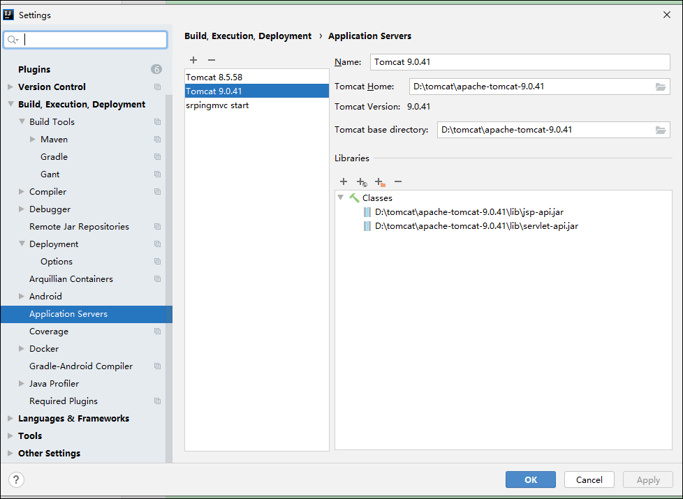
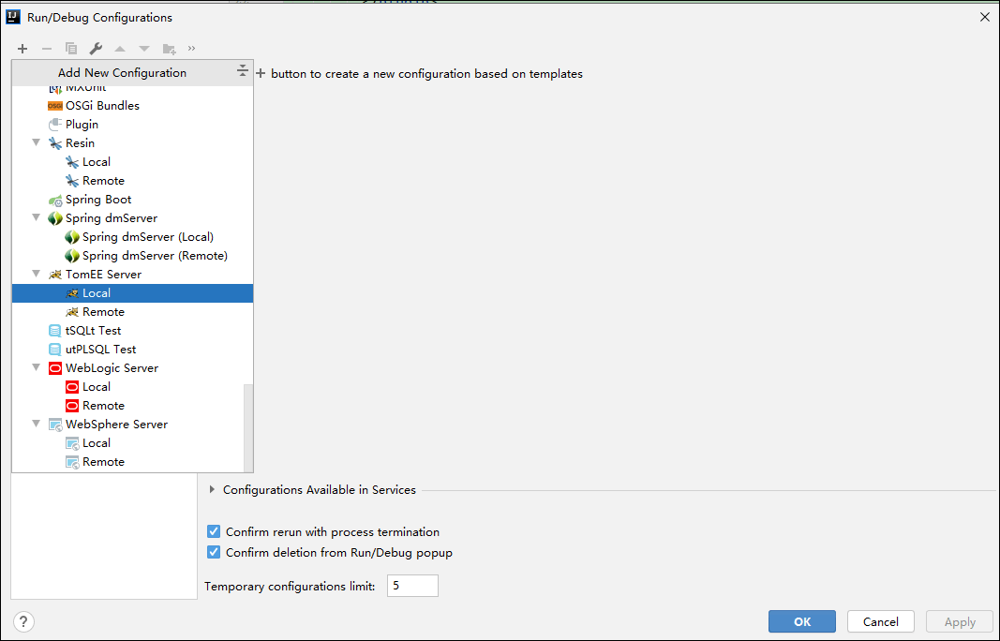
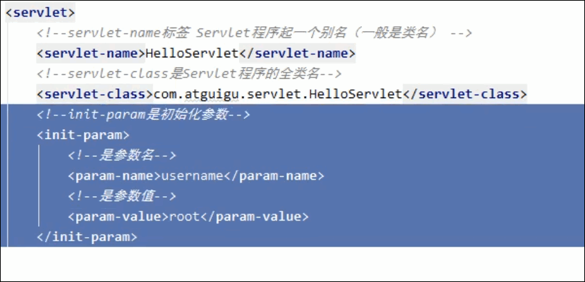

# Servlet

Servlet是JavaEE规范之一。

Servlet是JavaWeb三大组件之一。三大组件是：Servlet程序，Filter过滤器，Listener监听器。

Servlet 用来处理请求返回响应。


规范就是接口

```xml
<dependency>
  <groupId>javax.servlet</groupId>
  <artifactId>javax.servlet-api</artifactId>
  <version>4.0.1</version>
  <scope>provided</scope>
</dependency>
```


## Web应用程序的目录结构

project_name/pom.xml

project_name/src/main/java

project_name/src/main/resources

project_name/src/test/java

project_name/src/test/resources


project_name/src/main/webapp/WEB-INF/web.xml

project_name/src/main/webapp/index.jsp

roject_name/src/main/webapp/WEB-INF/lib 


## IDEA 创建Maven管理的web项目

 

## IDEA 配置Tomcat


File | Settings | Build, Execution, Deployment | Application Servers

 


 


```xml

```


## Tomcat 版本和Servlet的版本关系

servlet 3.0 以后 就使用注解版本的servlet。


## Tomcat三大部署项目方式

https://blog.csdn.net/sinat_32366329/article/details/80261706


默认访问的是ROOT 和 index.html


创建一个web 模块

 


### hello servlet

实现接口 javax.servlet.Servlet

web.xml中配置servlet 

```xml
<servlet>
    <servlet-name>Hello Servlet</servlet-name>
    <servlet-class>cn.java.money.servlet.HelloWorld</servlet-class>
</servlet>
<servlet-mapping>
    <servlet-name>Hello Servlet</servlet-name>
    <url-pattern>/hello</url-pattern>
</servlet-mapping>
```

http://localhost:8080/hello 


## servlet生命周期

执行构造器方法   第一次访问的时候执行

执行init 初始化方法  第一次访问的时候执行

执行service方法   每次请求都执行

执行destroy方法   


 


 


## ServletConfig,java 

 


init 方法要调用父类init, 否则servletconfig 是空的

## ServeltContext 

ServeltContext  是一个接口，表示servlet的上下文

一个web工程，只有一个ServletContext对象实例

ServletContex对象是一个域对象

域对象：可以像Map一样存取数据的对象，这里的域指的是存取数据的操作范围。

ServletContex对象是在web工程部署的时候创建的。

### ServletContext类的四个作用

获取web.xml中配置的上下文参数context-param

```xml
<context-param>
    <param-name>aa</param-name>
    <param-value>AA</param-value>
</context-param>
```

```java
System.out.println(getServletContext().getInitParameter("aa"));
```

获取当前的工程路径

获取工程部署以后再服务器硬盘上的绝对路径

```java
System.out.println(getServletContext().getContextPath()); //   /servlet_war
System.out.println(getServletContext().getRealPath("/")); //   D:\imooc\evn\apache-tomcat-8.5.58\webapps\servlet_war\
```

像Map一样存取数据

```
 getServletContext().setAttribute("","");
 getServletContext().getAttribute("");
```


