# 分布式系统开发实战篇 - TCC分布式事务实现

## 什么是事务

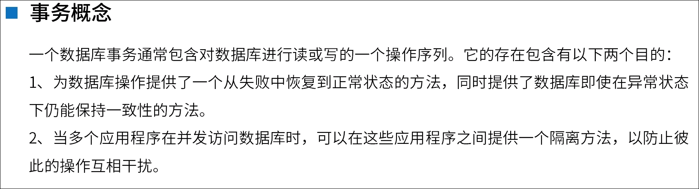

## 事务的特性

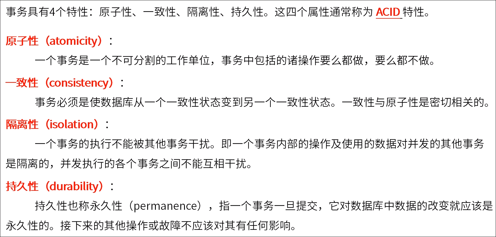

## 事务例子

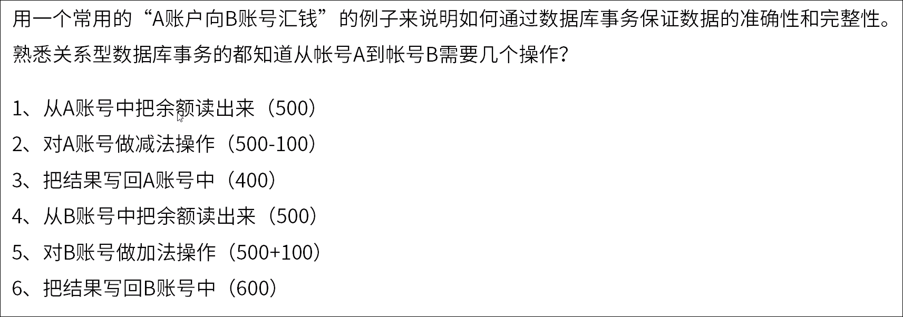

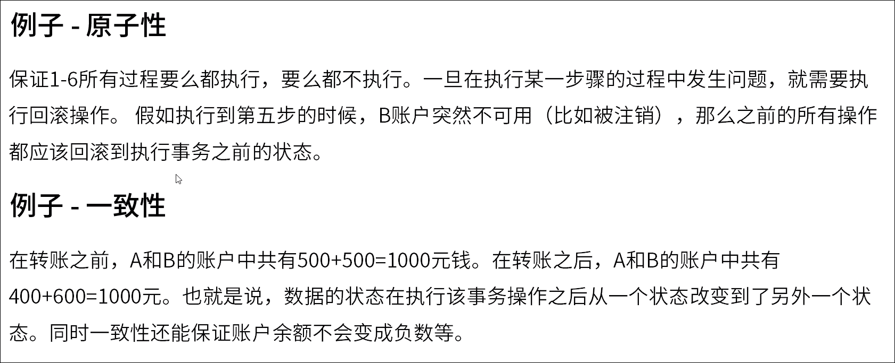 

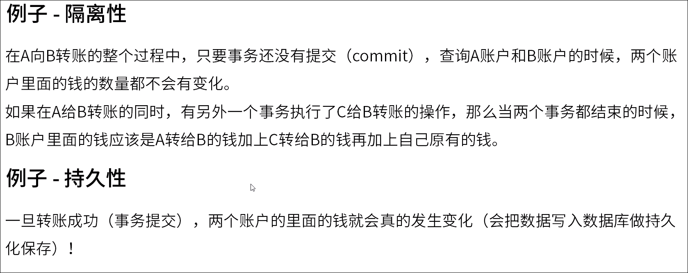

## 原子性和一致性

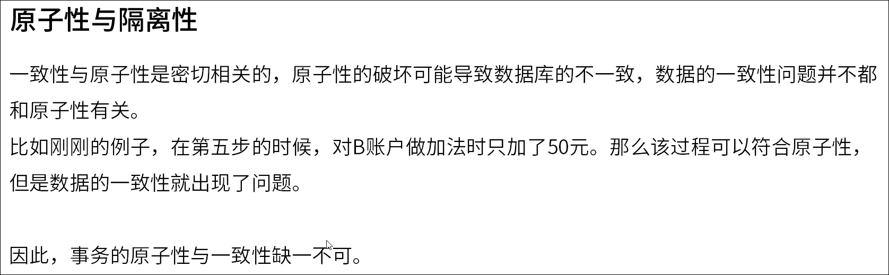

## 隔离性

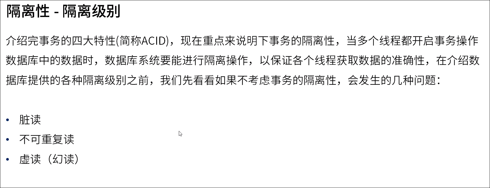

### 脏读

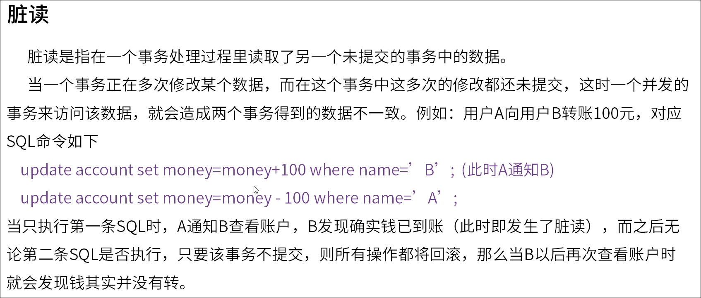

### 不可重复读

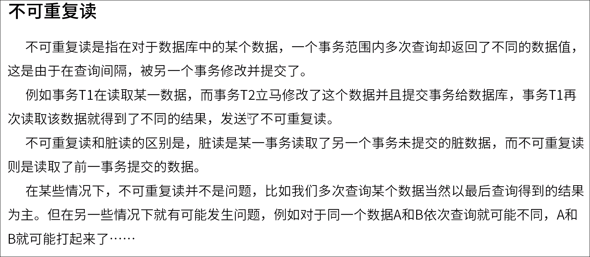

### 虚读

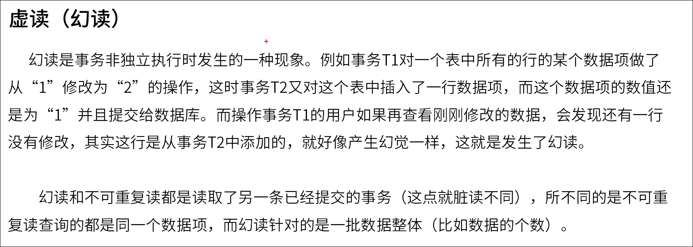

## MySQL隔离级别

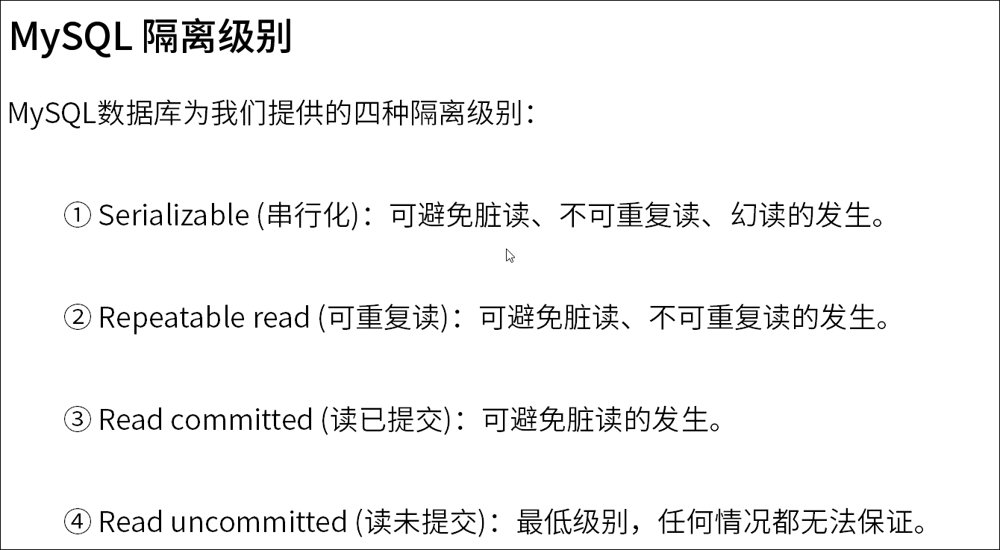

## 分布式事务

### 什么是分布式事务

### 分布式事务理论

#### CAP

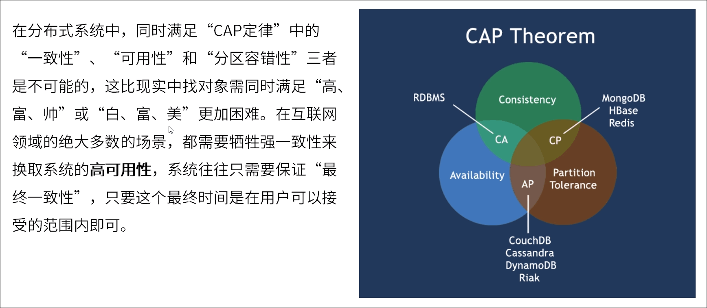

#### BASE理论

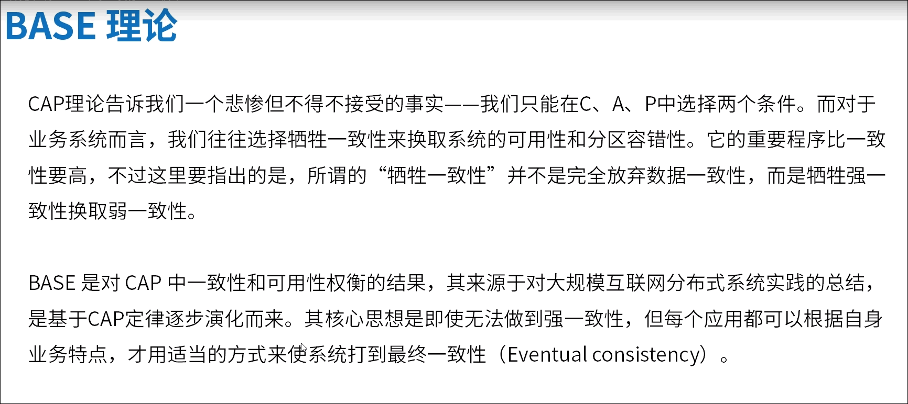

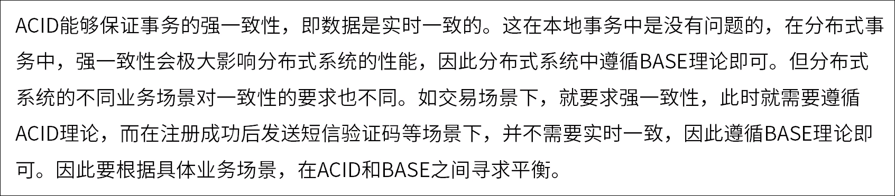

## 分布式事务协议

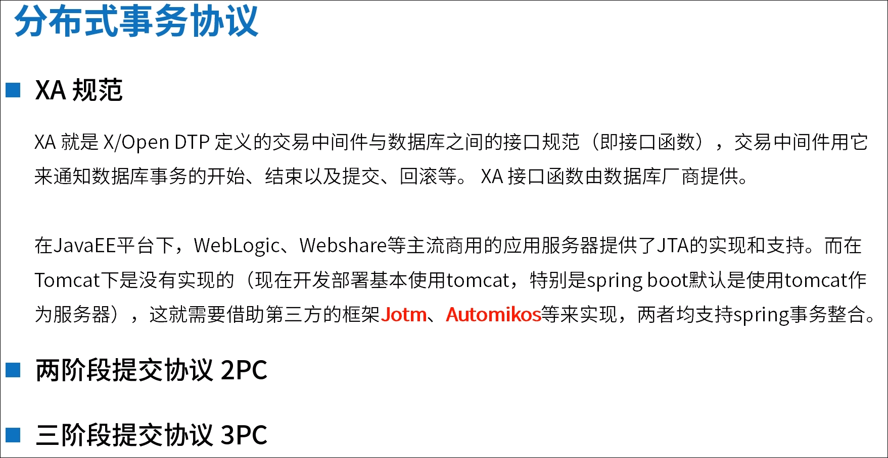

## 分布式事务解决方案

 

## TCC 补偿事务

**T**ry  **C**onfirm  **C**ancel

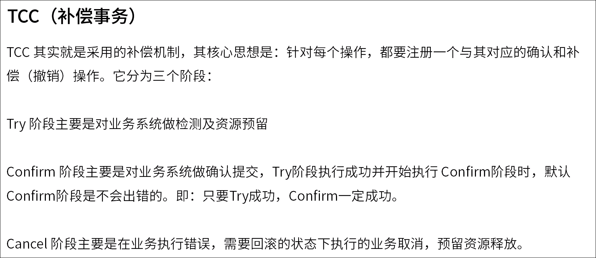

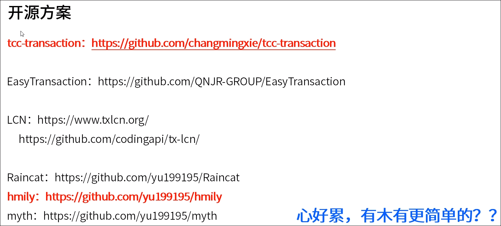

 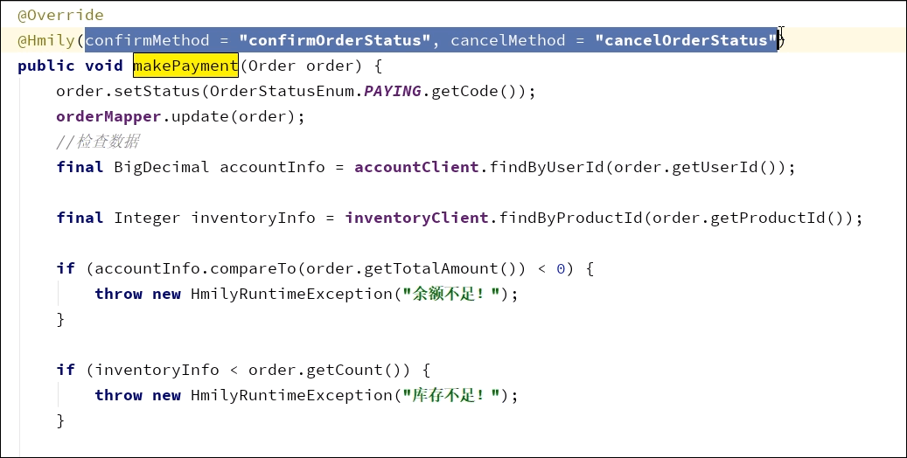

类似spring retry

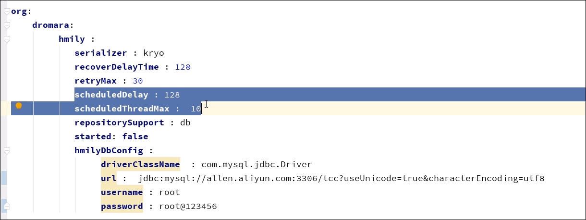

 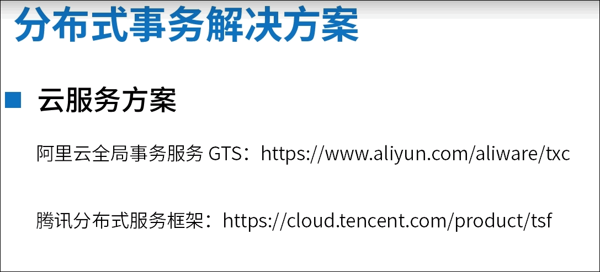

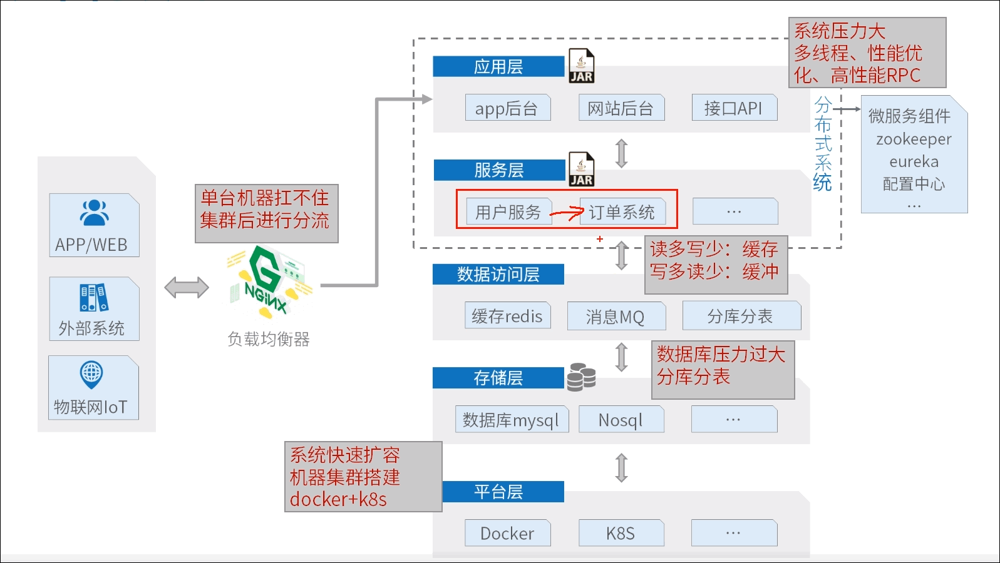

