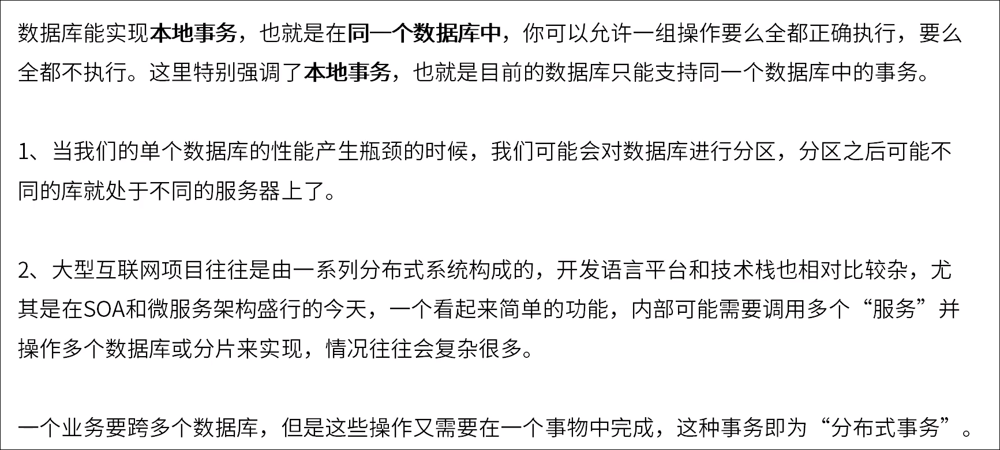
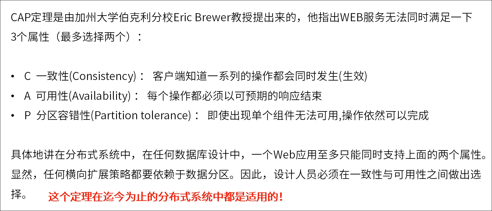
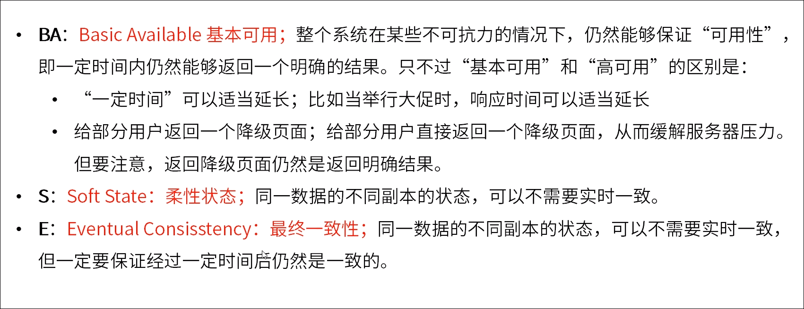
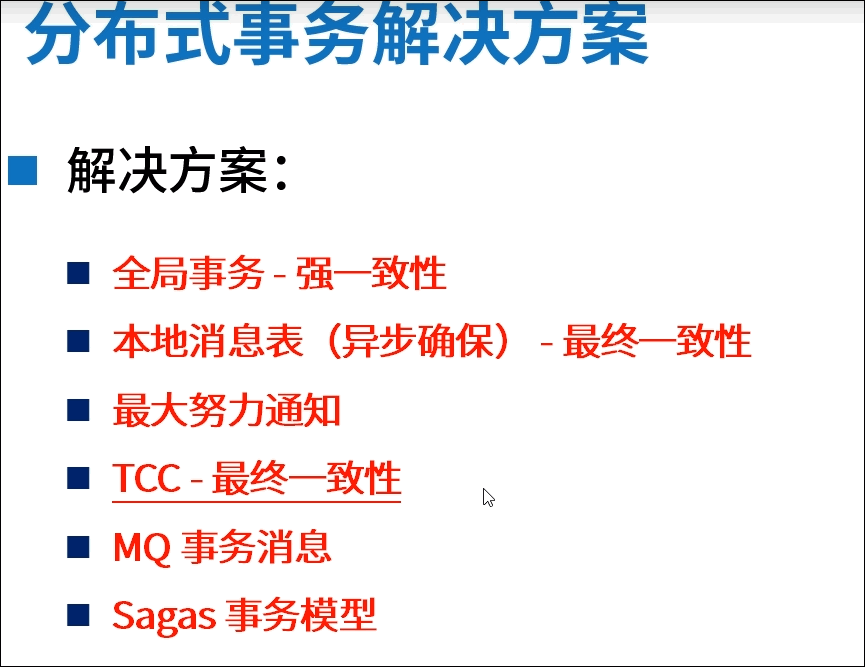

# 分布式系统开发实战篇 - TCC分布式事务实现

## 什么是事务

## 事务的特性

## 事务例子

 

## 原子性和一致性

## 隔离性

### 脏读

### 不可重复读

### 虚读

## MySQL隔离级别

## 分布式事务

### 什么是分布式事务

### 分布式事务理论

#### CAP

#### BASE理论

## 分布式事务协议

## 分布式事务解决方案

 

## TCC 补偿事务

**T**ry  **C**onfirm  **C**ancel

 

类似spring retry

 

