# 百亿交易额背后的缓存架构

https://www.bilibili.com/video/BV164411971L

## 系统架构

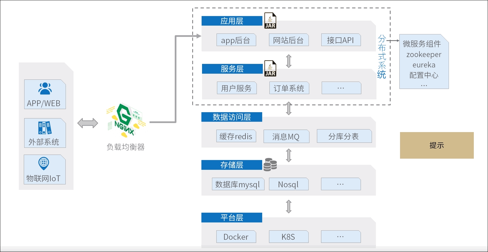

缓存：把数据从慢的介质挪到快的介质。

缓存为了提高用户的访问速度。

多去次数多，修改少才能采用缓存提高速度。

## 数据库缓存 

 数据库性能指标 连接数 IOPS TPS  QPS.

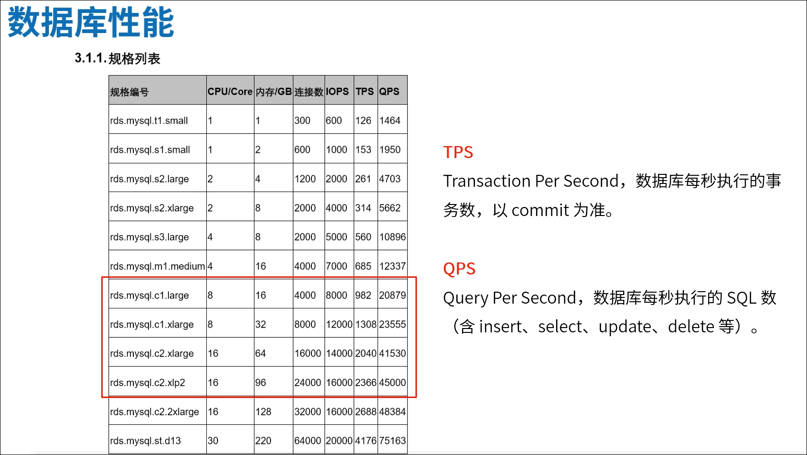

### MySQL数据库查询缓存

https://dev.mysql.com/doc/refman/5.7/en/query-cache.html

注意：The query cache is deprecated as of MySQL 5.7.20, and is removed in MySQL 8.0.

数据库专注于数据存储，把缓存交给应用层。

数据库中的数据是存储在磁盘中的，使用缓存以后就会在内存中查找。

##  应用层缓存

 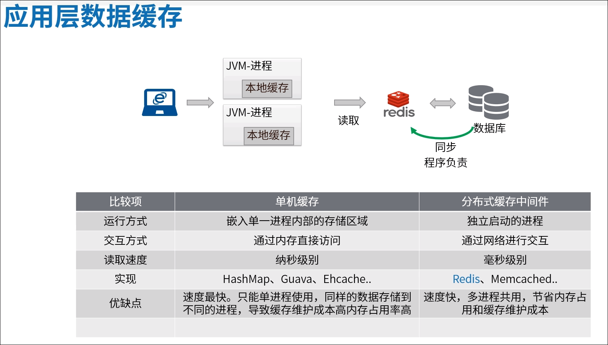

### 本地缓存（单机缓存）

本地缓存是在单个JVM进程中，不能被共用。

本地缓存占用JVM的内存。

多个JVM会对同一份数据缓存多次。

JDK 原生不支持缓存。

### 分布式缓存中间件

#### Redis

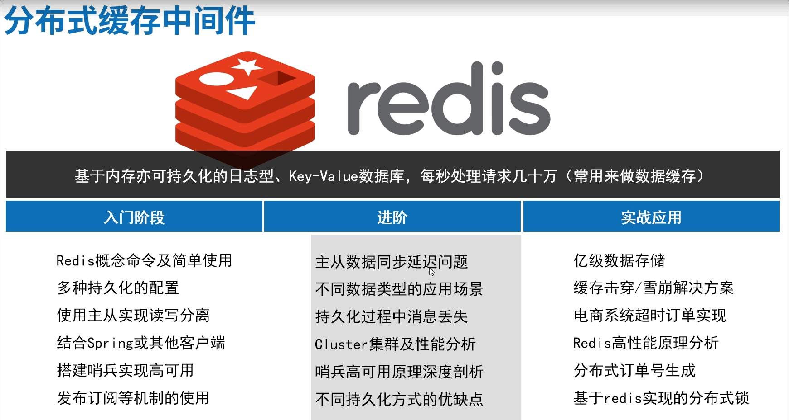

缓存数据和数据库中数据保持数据一致性？

没有100%的一致，要根据业务决定。

 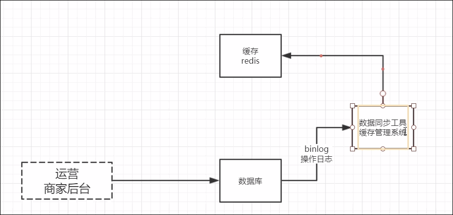

Canal 

ETL

## 浏览器缓存

节约服务器带宽， 带宽价格 贵。

假设 同一秒 有100 个人访问，一张图片1M， 就需要100M的带宽。

服务商的带宽 100MB是以MB=Mbit，而我们日常所说的1MByte=8Mbit。

 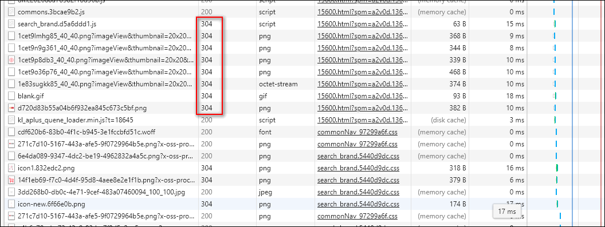

秒杀场景，页面数据有静态数据和动态数据，静态数据就可以缓存。 

### chrome 缓存文件查看

chrome://version/

 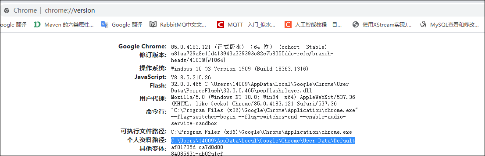

 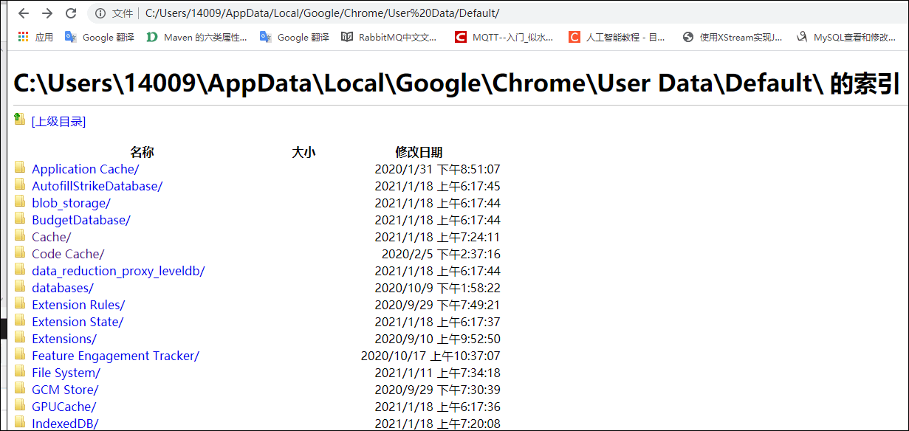

### 浏览器缓存的使用

**Filter技术实现**

Spring 中提供的 ShallowEtagHeaderFilter 就是具体实现。

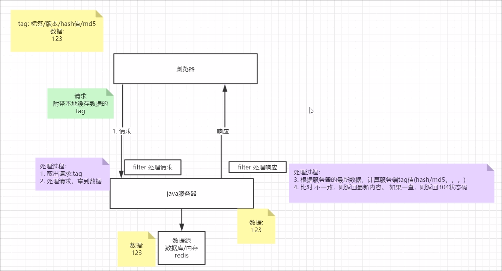

1. 浏览器发送第一次请求。
2. filter 发现没有ETag,直接去数据源获取数据。
3.  返回响应的数据和ETag
4. 浏览器保存ETag和数据
5. 下次请求，带着ETag
6. filter用浏览器的ETag和 服务器新生成的ETag比较，如果相同就返回304，告诉浏览器使用缓存。

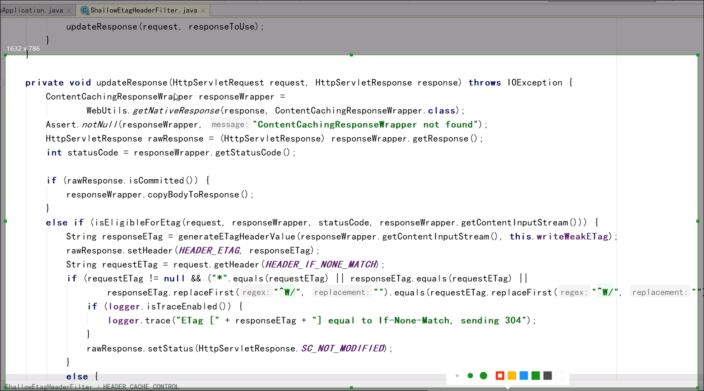

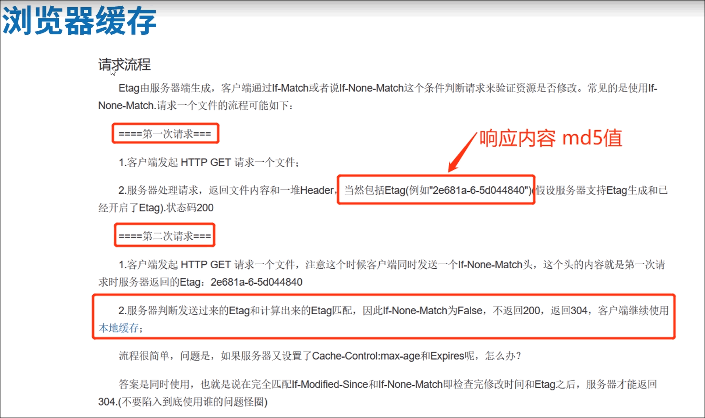

## 代理服务器缓存

nginx 缓存配置

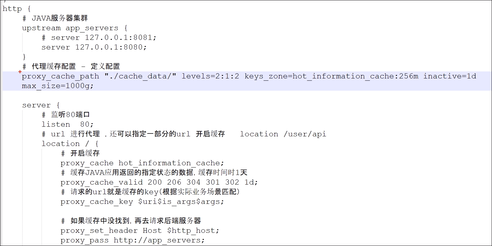

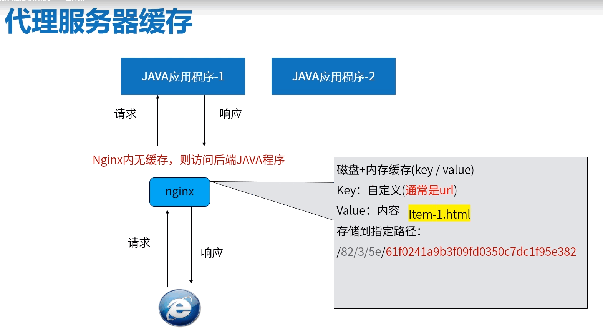

