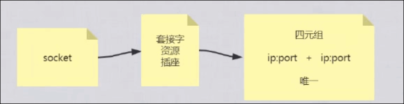

# 深入理解计算机网络底层原理

## 建立TCP连接

安装nc

```shell
 yum install nc
```

nc作用是创建一个连接

```shell
nc www.baidu.com  80
```

```
netstat -natp
```


说明：

- 创建了一个tcp连接 

- 本地地址192.168.0.4和随机端口46116

- 远程地址为220.181.38.150 （www.baidu.com 绑定的一台服务器地址）端口为80
- ESTABLISHED的意思是建立连接。表示两台机器正在通信。
- 9142 是进程id
- nc 是程序名称

## 应用层协议 HTTP

nc 建立连接

GET  /  HTTP/1.0 


注意：这里有空行。

是HTTP协议 请求行格式：请求方法 URI  协议版本

```
[root@JD1 ~]# nc www.baidu.com 80
GET / HTTP/1.0


```


## new ServerSocket(9090) 监听端口

服务器端运行以下代码

```java
import java.io.IOException;
import java.net.ServerSocket;

public class SocketIONEW {

    public static void main(String[] args) throws IOException {
        ServerSocket serverSocket = new ServerSocket(9090);
        System.in.read(); // 阻塞等待读取数据
    }
}
```

注意这里没有调用accept方法。


服务器启动进程监听9090端口。


与9090端口建立连接

```shell
nc localhost 9090
```

 

说明nc和服务器9090端口建立了连接。

 

最后一行的 “-” 表示服务端虽然建立了连接，但是没有分配给任何一个程序（映射文件描述符）。

是客户端和服务端的内核之间建立了连接。


客户端发送数据 hello

 

服务器接收到了6个字符（hello+换行符）

 

程序实际读取的是内核中缓存的数据。

应用层协议就是规定内容格式的一种字节数组。


 


## 传输控制层

TCP/UDP


### 什么是TCP协议

面向**连接**的**可靠**的传输协议。

### 三次握手

 

客户端发送一一个消息 SYN

服务器端返回一个 SYN+ACK

客户端发送ACK

完成三次握手以后，建立连接。

**连接就是客户端和服务端开辟资源**。


### 演示 三次握手


客户端内核发送一个SYN ,服务器接收到，但是我们客户端设置路由回不到客户端，就会停留在SYN_RECV的状态。


### 理解连接数量

Socket 套接字

客户端ip+客户端端口  和 服务器ip + 服务器端口 是唯一的。（四元组）

 

端口 65535


**四元组唯一**

 

一个客户端绑定一个ip地址 ， 和一台服务器的一个端口（比如tomcat 80端口）最多可以建立 65535个连接。

一个客户端如果绑定多个ip地址， 和一台服务器的一个端口（比如tomcat 80端口）最多可以建立 65535乘以客户端ip数量个连接。

一个客户端绑定一个ip地址 ， 和一台服务器的多个个端口（比如tomcat 80端口）最多可以建立 65535 乘以 服务器端口号个连接。

**总结： 只要四元组唯一，理论上就可以建立连接。**


### 四次分手

断开连接，释放资源。

资源是为对方服务。


 

